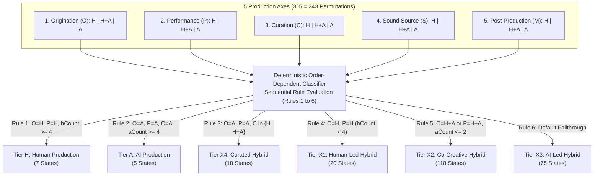
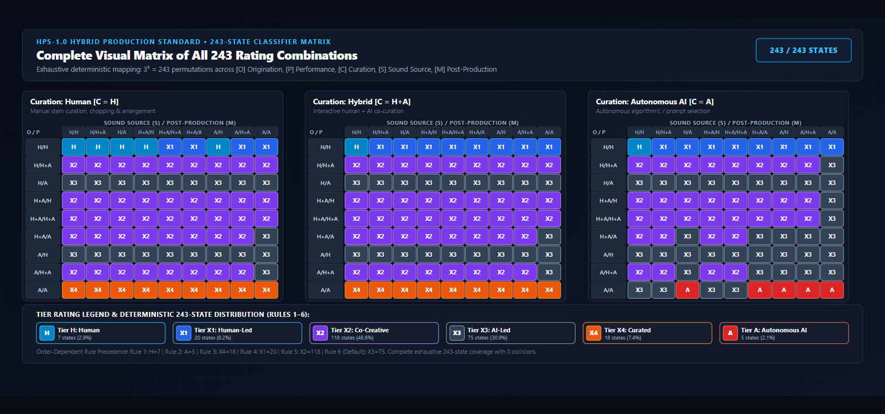
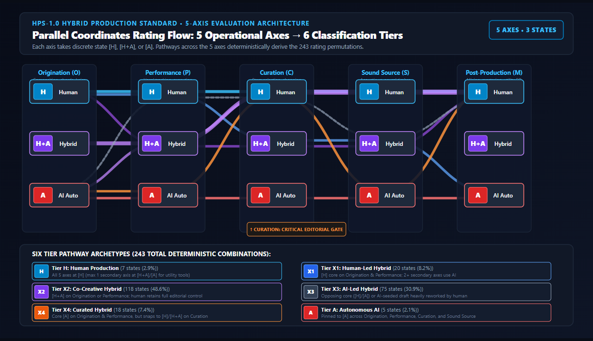

# Technical Whitepaper: The Hybrid Production Standard (HPS-1.0)

**A Multi-Axis Operational Framework for AI Attestation, Process Classification, Cryptographic Provenance, and Linked Data in Music Creation**

- **Standard Identifier**: HPS-1.0 Whitepaper
- **Document Version**: 1.0.6 (Engine-Synchronized Specification & Architecture)
- **Publication Date**: September 2026
- **Author**: Justin Ray / HPS Standards Working Group
- **Publisher Organization**: [TrustNodeLogic](https://trustnodelogic.com)
- **Reference Implementation**: [TrustNodeLogic HPS Engine](https://github.com/Loserdub/hps-attestation-engine) · Live Production: [trustnodelogic.web.app](https://trustnodelogic.web.app)
- **Contact & Inquiries**: [trustnodelogic.com/contact.html](https://trustnodelogic.com/contact.html) · `trustnodelogic@gmail.com`
- **Target Audience**: Audio Engineers, Software Developers, Music Distributors, Streaming Platforms (DSPs), Rights Management Societies, and Legal Compliance Officers

> ### Intellectual Property & Licensing Notice
> - **Whitepaper Documentation**: Copyright © 2026 Justin Ray / TrustNodeLogic. Published under [CC BY-ND 4.0](https://creativecommons.org/licenses/by-nd/4.0/).
> - **Schemas & Data Formats**: Associated JSON schemas and context files are licensed under the [MIT License](https://opensource.org/licenses/MIT) for open industry adoption.
> - **Proprietary Technology & Patent Reservation**: This document describes an architectural and operational framework. Nothing herein grants any right, title, license, or interest in or to any patent, trade secret, or proprietary implementation of the TrustNodeLogic attestation engine, forensic detection heuristics, or acoustic watermarking algorithms.
> - **Trademarks**: "HPS", "Hybrid Production Standard", and "TrustNodeLogic" are trademarks of TrustNodeLogic. No trademark license is granted.

---

## 1. Introduction & Scope

### 1.1 The Problem
The rapid emergence of artificial intelligence (AI) foundation models capable of symbolic composition, raw audio synthesis, neural vocal cloning, and automated mixing has transformed contemporary music production. As creators integrate AI tools alongside traditional performance and composition, the boundaries between human agency and algorithmic generation have blurred. 

Existing metadata systems and regulatory initiatives attempt to address this transformation through **binary disclosure flags** (e.g., `Is_AI_Generated: True/False`). Binary flags create severe systemic distortions:
- **Over-Flagging (False Positives)**: Human producers who utilize utility DSP tools (e.g., intelligent noise suppression, adaptive equalization, utility pitch tuning) are misclassified as "AI creators," exposing them to algorithmic penalties or rejection by distribution platforms.
- **Labor Stripping (False Negatives)**: Human producers who utilize a generative AI seed but spend dozens of hours re-arranging, chopping stems, writing original lyrics, tracking live acoustic instruments, and mixing the track have their human labor completely erased under an unqualified "AI" label.
- **Fragility**: Unsigned metadata checkboxes can be stripped or modified during file processing without detection, leaving rights organizations and marketplaces with unverifiable claims.

### 1.2 Why Provenance Matters
Provenance—the verifiable, immutable record of how an audio recording was created—is essential for:
1. **Legal & Regulatory Compliance**: Fulfilling mandatory transparency directives such as **Article 50 of the European Union AI Act (Regulation EU 2024/1689)**.
2. **Rights Management & Licensing**: Enabling collecting societies (BMI, ASCAP, PRS, SACEM) to calculate accurate royalty distributions based on human compositional contribution.
3. **Marketplace Transparency**: Providing sample libraries, distributors, and streaming platforms with verifiable proof of asset origins.
4. **Consumer & Artist Trust**: Protecting human musicians from credit erasure while giving AI-collaborative creators a transparent mechanism to disclose tool usage without stigma.

### 1.3 How HPS Solves the Transparency Gap
The **Hybrid Production Standard (HPS-1.0)** replaces binary disclosure with a granular, multi-dimensional classification system:
- **Process-Based Evaluation**: HPS measures *process*, not tool presence, evaluating human vs. AI contribution across five independent production stages (*Origination*, *Performance*, *Curation*, *Sound Source*, and *Post-Production*).
- **Deterministic 243-State Classification**: An order-dependent evaluation classifier maps all $3^5 = 243$ possible axis state combinations into a clear six-tier production scale (`H`, `X1`, `X2`, `X3`, `X4`, `A`).
- **Cryptographic Provenance & Tamper-Evidence**: Attestations are sealed into canonical JSON/JSON-LD manifests bound to the uncompressed Pulse Code Modulation (PCM) audio essence and multitrack DAW session via SHA-256 digests and RFC 8032 Ed25519 digital signatures.
- **Container Embedding & Theoretical Acoustic Watermarking**: Manifest payloads travel directly with the audio file via RIFF container chunks (`hps1`), ID3v2.4 frames (`TXXX`), DDEX ERN 4.3 XML blocks (`<hps:HPSClassificationBlock>`), alongside an open theoretical reference specification for inaudible time-domain spread-spectrum acoustic watermarks.

---

## 2. Definitions & Normative Terminology

To facilitate industry adoption across standards bodies (AES, DDEX, ISO), the following formal terms are defined for HPS-1.0:

- **Attestation**: A cryptographically signed, self-declared statement (optionally informed by automated DAW session introspection) describing human versus AI participation across five production axes for a specific recording. An attestation provides tamper-evidence of the declared record; it does not constitute third-party certification of truthfulness.
- **Axis State**: The discrete evaluation value (`H` for Human, `H+A` for Hybrid Collaboration, or `A` for Autonomous AI) assigned to one of the five creation stages (*Origination*, *Performance*, *Curation*, *Sound Source*, *Post-Production*).
- **Generative Autonomy**: The capability of an artificial intelligence model or neural network to generate novel musical structures, MIDI sequences, lyrics, vocal performances, or audio waveforms without direct real-time human performance or manual compositional notation.
- **Hybrid Production**: Any music creation workflow where human creative agency and generative AI systems collaborate interactively across one or more production stages.
- **Linked Data Graph**: A W3C JSON-LD 1.1 metadata structure utilizing `@context`, `@id`, and `@type` parameters to bind attestation manifestations to authoritative web graph entities (e.g., `https://example-publisher.com/#organization`), enabling semantic interoperability.
- **Manifest**: The canonical UTF-8 JSON document adhering to Manifest Schema 2.0 containing the declared axis states, derived tier code, creator identity parameters, session digest, audio essence digest, revision history, and RFC 8032 Ed25519 digital signatures. Manifests are canonicalized using RFC 8785 JSON Canonicalization Scheme (JCS) prior to hashing and signing.
- **PCM Essence Digest**: The bit-exact SHA-256 cryptographic hash computed exclusively over uncompressed Pulse Code Modulation (PCM) sample data inside the WAV `data` subchunk, excluding container headers, ID3 tags, or metadata chunks, ensuring the hash remains valid even if metadata is restamped.
- **The 3-Point Cryptographic Seal**: The tripartite cryptographic binding between:
  1. **DAW Session Content Hash (`session_hash` / `session_binding`)**: SHA-256 hash computed over canonicalized multitrack project structure, track hierarchies, inserted plugin GUIDs, audio pool manifests, and clip bounds.
  2. **Master Audio Essence Hash (`audio_binding.value` / `content_hash`)**: Bit-exact SHA-256 hash computed over raw PCM audio bytes, independent of file wrappers.
  3. **Sovereign Ed25519 Identity Signatures (`signature` / `signatures[]`)**: Asymmetric RFC 8032 digital signatures generated by the creator (and optional co-signers) cryptographically sealing points 1 and 2 to the creator's identity.
- **Seal Status Classification**: The discrete integrity status assigned during manifest evaluation:
  - **`COMPLETE`**: All three points (Session, Audio, and Signature) are non-placeholder, bound, and cryptographically verified.
  - **`PARTIAL_SESSION_AUDIT`**: Session is bound and signed; Master Audio was not submitted.
  - **`PARTIAL_AUDIO_ATTESTATION`**: Master Audio is bound and signed; DAW session was not submitted (e.g. manual attestation workflow).
  - **`DECLARATION_ONLY`**: Creator signed axis declaration without session or audio bindings.
  - **`LEGACY_PARTIAL`**: Manifest conforms to Schema 1.0 (lacking session binding; cannot claim a full 3-point seal).
  - **`TAMPERED`**: Hash mismatch against the verified session file or master audio PCM waveform.
  - **`INVALID`**: Signature verification failure or corrupt manifest syntax.
- **4-Layer Versioning Architecture**: The strict decoupling of protocol layers into:
  1. **HPS Standard Version** (`1.0`): The normative 5-axis classification and deterministic 243-state classifier rules.
  2. **Manifest Schema Version** (`2.0`): The machine-readable JSON structure incorporating 3-point seal bindings, multi-signer arrays, and active Merkle chaining.
  3. **Engine Software Version** (`1.0.6`): The semantic release version of the reference attestation engine.
  4. **Fingerprint Database / Oracle Layer**: Dynamic forensic signature datasets and AI-model attribution tables.
- **Keystore Protocol (`.hpskey`)**: A standardized client-side JSON vault format (`https://hps-standard.org/schemas/v0.1/keystore.json`) for securely exporting, importing, and backing up sovereign Ed25519 identity keypairs, supporting optional passphrase-derived AES-GCM (PBKDF2 with 250,000 SHA-256 iterations) encryption at rest.
- **Track Discovery Provenance (`sourceMethod`)**: An attribution metadata tag attached to individual tracks by DAW forensic parsers distinguishing `structured-table-scan` (high/medium confidence extraction from structural chunks) from `generic-keyword-match` (low-confidence fallback scraping from printable strings).

---

## 3. Background & Motivation

### 3.1 The Rise of AI-Generated Music and Workflow Hybridization
Music technology has continually evolved through technological augmentation—from multitrack magnetic tape to MIDI sequencing and software synthesizers. Modern neural models differ fundamentally because they possess *generative autonomy*. Deep learning architectures can now synthesize full two-channel audio waveforms, generate complex MIDI arrangements, and emulate human singing voices from simple text prompts.

However, professional music creation rarely occurs in binary isolation. Musicians infrequently rely on 100% autonomous prompt generation; instead, modern workflows are deeply hybrid:
- A producer may generate a harmonic progression using a generative assistant, manually chop and re-pitch the MIDI, track a human lead vocal, synthesize backing harmonies via neural models, and mix the project in a traditional Digital Audio Workstation (DAW).
- A songwriter may record live acoustic guitar and lead vocals, but use generative diffusion models to construct background environmental soundscapes or automated mastering engines to finalize dynamic range.

### 3.2 Lack of Provenance Standards in Audio Containers
Standard digital audio container formats (such as WAV RIFF, MP3, FLAC, and AAC) were designed to convey uncompressed or compressed sample payloads, not production provenance. When a DAW project is rendered to a flat audio master, all structural session metadata—plugin inventories, track arrangements, MIDI parameters, and edit histories—is stripped.

Downstream actors in the music supply chain (distributors, aggregators, streaming services, and performance rights organizations) receive flat audio files without any mechanism to verify how the content was produced.

### 3.3 Systemic Risks Across the Supply Chain

```
+-------------------+      +-------------------+      +-------------------+
|  CREATORS         | ---> |  DISTRIBUTORS     | ---> |  MARKETPLACES &   |
| Risk: Credit      |      | Risk: Regulatory  |      |  STREAMING DSPs   |
| erasure & over-   |      | non-compliance &  |      | Risk: Catalog     |
| flagging penalty  |      | audit liability   |      | pollution & fraud |
+-------------------+      +-------------------+      +-------------------+
```

- **For Artists**: Risk of systemic over-flagging by automated detection algorithms, loss of copyright protection, or complete erasure of human editorial effort.
- **For Distributors**: Exposure to legal non-compliance penalties under regional AI transparency regulations, inability to audit incoming catalog submissions, and ingestion pipeline delays.
- **For Marketplaces & Streaming DSPs**: Inability to differentiate authentic human recordings from mass-generated synthetic spam, resulting in catalog pollution and listener churn.

---

## 4. The HPS Framework & 243-State Matrix

HPS-1.0 establishes an objective, deterministic framework for attesting to and classifying human and AI participation.


```
       [H] -------------- [X1] -------------- [X2] -------------- [X3] -------------- [X4] -------------- [A]
Human Production   Human-Led Hybrid    Co-Creative Hybrid    AI-Led Hybrid      Curated Hybrid     AI Production
 (AI Utility Only)  (Human Lead/Perf)  (Direct Co-Creation) (AI Seed/Human Rework) (AI Gen/Human Edit) (100% Synthetic)
```

### 4.1 The Five Operational Axes
HPS-1.0 evaluates a music recording across five discrete, sequential stages of production:

1. **Origination ($O$)**: Composition, songwriting, melody, chord progressions, lyrics, and structural seed generation.
2. **Performance ($P$)**: Vocal tracking, physical instrument performance, MIDI execution, and expressive timing.
3. **Curation ($C$)**: Editorial stem selection, structural chopping, arrangement sequencing, and sound editing.
4. **Sound Source ($S$)**: Timbral provenance (acoustic instruments, analog/subtractive synthesis, vs. neural diffusion sound generators).
5. **Post-Production ($M$)**: Dynamic processing, equalization, spatial placement, mixing, and final mastering.

### 4.2 Permissible Axis States & Utility Processing Exemption
Every axis MUST be evaluated to exactly one of three permissible states:
- **`H` (Human)**: Executed exclusively by human labor or traditional non-generative processing.
- **`H+A` (Human + AI Collaborative)**: Executed via interactive collaboration between human creators and generative AI tools.
- **`A` (AI Autonomous)**: Executed by generative AI systems or neural models without active human performance or compositional modification.

#### Normative Utility DSP Exemption Rule
Standard non-generative utility digital signal processing (e.g., static equalizers, dynamic compressors, surgical notch filters, parametric reverb, and utility pitch correction used strictly for intonation tuning) MUST be classified as **`H`**. A tool MUST NOT be classified as `A` or `H+A` merely because its internal parameters utilize machine learning optimization heuristics, provided it does not generate novel compositional, performance, or timbral material.

#### 4.2.1 Proportional Arrangement Contribution Index (ACI) & Incidental AI Exemption Rule
To prevent minor incidental background elements (such as a 2-second generative transition sweep, an auxiliary reverse crash, or an incidental ambient sound effect) from disproportionately contaminating an otherwise human production, HPS-1.0 defines the **Proportional Arrangement Contribution Index (ACI)**. Rather than applying a binary or greedy override upon tool detection, the standard evaluates both **temporal arrangement coverage** and **hierarchical channel importance**:

1. **Channel Hierarchy Weights ($W_{role}$)**: Tracks are classified into structural arrangement roles with proportional weights:
   - `Primary Master Bus`: $1.0$ (Mix-wide processing)
   - `Primary Lead Vocal`: $1.0$ (Focal performance identity)
   - `Primary Instrument`: $1.0$ (Core melodic/harmonic arrangement)
   - `Secondary Return / Auxiliary Bus`: $0.35$ (Parallel effects, reverbs, submixes)
   - `Secondary Transition Sweep / Sound FX`: $0.30$ (Risers, downlifters, impacts, foley)
   - `Secondary Incidental Sample`: $0.25$ (Short one-shots with duration $< 3.0\text{ seconds}$)

2. **Mathematical Formulation**:
   $$\text{Coverage Ratio} = \frac{\text{Active Timeline Duration of Flagged Asset}}{\text{Total Project Arrangement Duration}}$$
   $$\text{ACI} = \text{Coverage Ratio} \times W_{role}$$

3. **Normative Decision Thresholds**:
   - **Incidental AI Exemption ($\text{ACI} < 0.05 / 5\%$)**: If the weighted ACI of a detected generative AI tool or sample is strictly less than $5\%$, the primary production axis is protected and remains classified as **`H` (Human Production)**. The asset receives an **"Incidental Tool Disclosure"** tag in the manifest's `tool_chain` and audit evidence, ensuring legal transparency without penalizing the primary tier.
   - **Substantial Hybrid Contribution ($0.05 \le \text{ACI} < 0.50$)**: When an AI asset contributes between $5\%$ and $50\%$ weighted arrangement presence, the affected axis is classified as **`H+A` (Co-Creative Hybrid)**.
   - **Dominant AI Contribution ($\text{ACI} \ge 0.50$)**: When an AI asset contributes $50\%$ or more of the weighted arrangement, the affected axis escalates to **`A` (AI Autonomous)** if generative, or `H+A` if assistive DSP.

4. **Multi-Asset Channel Isolation**: Incidental auxiliary sweeps and background sound design are strictly isolated to their host channel roles. They MUST NOT bleed into or contaminate lead vocal performance ($P$) or primary acoustic instrument tracking declarations ($S$).

### 4.3 The Human→AI Production Scale (6 Tiers)

| Tier Code | Tier Name | Formal Definition | Normative Condition | Classified State Count |
| :--- | :--- | :--- | :--- | :---: |
| **`H`** | **Human Production** | 100% human creation and execution across primary axes. AI usage is strictly restricted to corrective post-production utility tools. | $O=\text{H} \land P=\text{H} \land hCount \ge 4$ | **7 states** |
| **`X1`** | **Human-Led Hybrid** | Primary composition and performance are fully human-executed; generative AI is utilized solely for secondary textures or automated post-production. | $O=\text{H} \land P=\text{H} \land hCount < 4$ | **20 states** |
| **`X2`** | **Co-Creative Hybrid** | Human and AI collaborate directly during origination or performance. Human retains full editorial, structural, and arrangement control. | $(O=\text{H+A} \lor P=\text{H+A}) \land aCount \le 2$ | **118 states** |
| **`X3`** | **AI-Led Hybrid** | Generative AI provides the primary structural or compositional seed; a human producer substantially reworks, re-samples, or edits the material into a final work. | Default fallthrough for unassigned hybrid states | **75 states** |
| **`X4`** | **Curated Hybrid** | Generative AI executes composition, performance, and sound synthesis; human involvement is confined to selection, structural arrangement, stem mixing, and curation. | $O=\text{A} \land P=\text{A} \land C \in \{\text{H}, \text{H+A}\}$ | **18 states** |
| **`A`** | **AI Production** | Fully synthetic generation across composition, performance, curation, and synthesis. Human input is limited to text prompts or unedited selection. | $O=\text{A} \land P=\text{A} \land C=\text{A} \land aCount \ge 4$ | **5 states** |
| **Total** | | **Complete Exhaustive Coverage** | | **243 states** |

### 4.4 The 243-State Classifier Architecture & Flow

The 5 production axes with 3 state options yields exactly $3^5 = 243$ unique operational configurations. The diagram below illustrates how all 243 states pass through the order-dependent evaluation rules without collision or unclaimed states:



#### Ordering Rationale & The Curation Editorial Gate

The 6-rule sequential evaluation is order-dependent by design, preventing multi-tier collisions and establishing rigorous legal auditability:

- **The Curation Axis as an Editorial Gate**: When both primary composition and performance are fully executed by autonomous AI ($O = \text{A} \land P = \text{A}$), human creative agency can only enter the production pipeline through **Curation ($C$)**—the conscious editorial acts of auditioning, stems chopping, re-sequencing, and arrangement assembly:
  - **Rule 2 Gate ($C = \text{A}$)**: Tier A (AI Production) strictly requires that Curation is autonomous ($C = \text{A}$). This hard gate ensures that Tier A is reserved exclusively for unedited, prompt-direct outputs where no human arrangement labor took place.
  - **Rule 3 Gate ($C \in \{\text{H}, \text{H+A}\}$)**: If a human producer actively curates, chops, or re-arranges those AI stems into a structured musical composition, Rule 3 captures the track as **`Tier X4` (Curated Hybrid)**. This acts as a vital protective gate: even if 4 of the 5 axes are AI ($O=\text{A}, P=\text{A}, S=\text{A}, M=\text{A}$), the presence of human curation prevents the track from being falsely categorized as 100% synthetic spam, preserving human copyright protection and editorial attribution.
  - **Mathematical Auditability**: To ensure Curation is not merely a subjective claim, HPS specifies objective arrangement topology forensics (detailed in §6.2), quantifying the **Monolithic Continuity Ratio ($C_{mono}$)**, **Edit Density per 16 Bars ($E_{16}$)**, and **Human Edit Factor (HEF)** to mathematically distinguish authentic human micro-editing from uncurated stem dumps.
- **Collision Prevention**: Evaluating Rule 2 ($C=\text{A}$) before Rule 3 ($C \in \{\text{H}, \text{H+A}\}$) guarantees that states like $O=\text{A}, P=\text{A}, S=\text{A}, M=\text{A}, C=\text{H}$ (textbook Tier X4 sample pack curation) are never trapped by a naive "majority AI" filter, guaranteeing 100% deterministic coverage with zero collisions across all 243 permutations.

### 4.5 Visual Matrix of All 243 Rating Combinations

The 5 operational production axes ($O, P, C, S, M$), each taking 3 potential values (`H`, `H+A`, `A`), produce an exhaustive decision space of $3^5 = 243$ discrete state permutations. The visual matrix illustration below depicts this complete state space, mapping every possible axis combination directly to its deterministically derived HPS rating tier.


*Figure 4.2: Complete Visual Matrix of All 243 HPS Rating Combinations across 3 Curation Planes ($C=\text{H}$, $C=\text{H+A}$, $C=\text{A}$). [Interactive Vector SVG Version](assets/hps_243_matrix_combinations.svg).*

#### Reading the Matrix

- **Rows ($O \times P$)**: The 9 primary composition & performance postures, representing the core human vs. AI musical creation.
- **Columns ($S \times M$)**: The 9 sound source & post-production configurations, representing sonic timbre and engineering provenance.
- **Planes ($C$)**: The 3 distinct editorial planes of Curation ($C=\text{Human}$, $C=\text{Hybrid}$, $C=\text{AI}$), representing editorial control, stem chopping, and arrangement sequencing.
- **Cell Ratings**:
  - 🟦 **`H` (Human Production)**: 7 states (2.9%)
  - 🔷 **`X1` (Human-Led Hybrid)**: 20 states (8.2%)
  - 🟪 **`X2` (Co-Creative Hybrid)**: 118 states (48.6%)
  - 🔘 **`X3` (AI-Led Hybrid)**: 75 states (30.9%)
  - 🟧 **`X4` (Curated Hybrid)**: 18 states (7.4%)
  - 🟥 **`A` (Autonomous AI)**: 5 states (2.1%)

---

#### Plane 1: Curation = Human ($C = \text{H}$)
*Manual stem curation, chopping, arrangement & sequencing by human producer (81 States)*

| $O \backslash P$ | H / H | H / H+A | H / A | H+A / H | H+A / H+A | H+A / A | A / H | A / H+A | A / A |
| :---: | :---: | :---: | :---: | :---: | :---: | :---: | :---: | :---: | :---: |
| **H / H** | `H` | `H` | `H` | `H` | `X1` | `X1` | `H` | `X1` | `X1` |
| **H / H+A** | `X2` | `X2` | `X2` | `X2` | `X2` | `X2` | `X2` | `X2` | `X2` |
| **H / A** | `X3` | `X3` | `X3` | `X3` | `X3` | `X3` | `X3` | `X3` | `X3` |
| **H+A / H** | `X2` | `X2` | `X2` | `X2` | `X2` | `X2` | `X2` | `X2` | `X2` |
| **H+A / H+A** | `X2` | `X2` | `X2` | `X2` | `X2` | `X2` | `X2` | `X2` | `X2` |
| **H+A / A** | `X2` | `X2` | `X2` | `X2` | `X2` | `X2` | `X2` | `X2` | `X3` |
| **A / H** | `X3` | `X3` | `X3` | `X3` | `X3` | `X3` | `X3` | `X3` | `X3` |
| **A / H+A** | `X2` | `X2` | `X2` | `X2` | `X2` | `X2` | `X2` | `X2` | `X3` |
| **A / A** | `X4` | `X4` | `X4` | `X4` | `X4` | `X4` | `X4` | `X4` | `X4` |

---

#### Plane 2: Curation = Hybrid ($C = \text{H+A}$)
*Interactive human-AI co-curation, automated arrangement suggestions with human editorial review (81 States)*

| $O \backslash P$ | H / H | H / H+A | H / A | H+A / H | H+A / H+A | H+A / A | A / H | A / H+A | A / A |
| :---: | :---: | :---: | :---: | :---: | :---: | :---: | :---: | :---: | :---: |
| **H / H** | `H` | `X1` | `X1` | `X1` | `X1` | `X1` | `X1` | `X1` | `X1` |
| **H / H+A** | `X2` | `X2` | `X2` | `X2` | `X2` | `X2` | `X2` | `X2` | `X2` |
| **H / A** | `X3` | `X3` | `X3` | `X3` | `X3` | `X3` | `X3` | `X3` | `X3` |
| **H+A / H** | `X2` | `X2` | `X2` | `X2` | `X2` | `X2` | `X2` | `X2` | `X2` |
| **H+A / H+A** | `X2` | `X2` | `X2` | `X2` | `X2` | `X2` | `X2` | `X2` | `X2` |
| **H+A / A** | `X2` | `X2` | `X2` | `X2` | `X2` | `X2` | `X2` | `X2` | `X3` |
| **A / H** | `X3` | `X3` | `X3` | `X3` | `X3` | `X3` | `X3` | `X3` | `X3` |
| **A / H+A** | `X2` | `X2` | `X2` | `X2` | `X2` | `X2` | `X2` | `X2` | `X3` |
| **A / A** | `X4` | `X4` | `X4` | `X4` | `X4` | `X4` | `X4` | `X4` | `X4` |

---

#### Plane 3: Curation = Autonomous AI ($C = \text{A}$)
*Fully automated algorithmic sequencing, neural arrangement, or prompt-direct output (81 States)*

| $O \backslash P$ | H / H | H / H+A | H / A | H+A / H | H+A / H+A | H+A / A | A / H | A / H+A | A / A |
| :---: | :---: | :---: | :---: | :---: | :---: | :---: | :---: | :---: | :---: |
| **H / H** | `H` | `X1` | `X1` | `X1` | `X1` | `X1` | `X1` | `X1` | `X1` |
| **H / H+A** | `X2` | `X2` | `X2` | `X2` | `X2` | `X2` | `X2` | `X2` | `X3` |
| **H / A** | `X3` | `X3` | `X3` | `X3` | `X3` | `X3` | `X3` | `X3` | `X3` |
| **H+A / H** | `X2` | `X2` | `X2` | `X2` | `X2` | `X2` | `X2` | `X2` | `X3` |
| **H+A / H+A** | `X2` | `X2` | `X2` | `X2` | `X2` | `X2` | `X2` | `X2` | `X3` |
| **H+A / A** | `X2` | `X2` | `X3` | `X2` | `X2` | `X3` | `X3` | `X3` | `X3` |
| **A / H** | `X3` | `X3` | `X3` | `X3` | `X3` | `X3` | `X3` | `X3` | `X3` |
| **A / H+A** | `X2` | `X2` | `X3` | `X2` | `X2` | `X3` | `X3` | `X3` | `X3` |
| **A / A** | `X3` | `X3` | `A` | `X3` | `X3` | `A` | `A` | `A` | `A` |

---

#### State Distribution Summary by Creative Posture ($O \times P$)

| Origination ($O$) & Performance ($P$) | Total Combinations | `H` | `X1` | `X2` | `X3` | `X4` | `A` | Dominant Tier Classification |
| :--- | :---: | :---: | :---: | :---: | :---: | :---: | :---: | :--- |
| **H / H** (Human Composition & Performance) | 27 | 7 | 20 | 0 | 0 | 0 | 0 | `X1` (74%) / `H` (26%) |
| **H / H+A** (Human Composition, Hybrid Perf) | 27 | 0 | 0 | 26 | 1 | 0 | 0 | `X2` (96%) |
| **H / A** (Human Composition, AI Perf) | 27 | 0 | 0 | 0 | 27 | 0 | 0 | `X3` (100%) |
| **H+A / H** (Hybrid Composition, Human Perf) | 27 | 0 | 0 | 26 | 1 | 0 | 0 | `X2` (96%) |
| **H+A / H+A** (Co-Creative Composition & Perf) | 27 | 0 | 0 | 26 | 1 | 0 | 0 | `X2` (96%) |
| **H+A / A** (Hybrid Composition, AI Perf) | 27 | 0 | 0 | 20 | 7 | 0 | 0 | `X2` (74%) / `X3` (26%) |
| **A / H** (AI Seed, Human Performance) | 27 | 0 | 0 | 0 | 27 | 0 | 0 | `X3` (100%) |
| **A / H+A** (AI Seed, Hybrid Performance) | 27 | 0 | 0 | 20 | 7 | 0 | 0 | `X2` (74%) / `X3` (26%) |
| **A / A** (AI Composition & AI Performance) | 27 | 0 | 0 | 0 | 4 | 18 | 5 | `X4` (67%) / `A` (19%) / `X3` (15%) |
| **Total Permutations** | **243** | **7** | **20** | **118** | **75** | **18** | **5** | **100.0% Exhaustive Deterministic Coverage** |

---

### 4.6 5-Axis Parallel Rating Flow & Unified Decision Table

While the 243-cell matrix in §4.5 provides exhaustive cell-by-cell verification, the most intuitive way to trace any production workflow is the **5-Axis Parallel Coordinates Flow**. Each of the 5 operational production axes ($O, P, C, S, M$) takes exactly one of three discrete states (`H`, `H+A`, or `A`):


*Figure 4.3: Parallel Coordinates Rating Flow across the 5 Production Axes. Each axis snaps to [H], [H+A], or [A]. Pathways across the 5 axes deterministically derive all 243 rating permutations. [Vector SVG Version](assets/hps_5_axis_flow_matrix.svg).*

#### ASCII 5-Axis Flow Architecture

```text
====================================================================================================================
                                  HPS-1.0 5-AXIS PARALLEL RATING FLOW ARCHITECTURE
====================================================================================================================
     [1] Origination       [2] Performance         [3] Curation         [4] Sound Source     [5] Post-Production
      (Songwriting)       (Vocals/Execution)     (Stem Arranging)      (Acoustic/Diffusion)      (Mix/Master)
     +---------------+     +---------------+     +---------------+      +---------------+     +-----------------+
     |      [H]      |=====|      [H]      |=====|      [H]      |======|      [H]      |=====|       [H]       | ==> TIER H (7)
     |               |     |               |     \---------------\      \---------------\     \-----------------\
     |     [H+A]     |-----|     [H+A]     |----------------------------|---------------------|-----------------| ==> TIER X1 (20) / X2 (118)
     |               |     |               |     /---------------/      /---------------/     /-----------------/
     |      [A]      |-----|      [A]      |---*-| [H] / [H+A]   | (Gate)      [A]      |-----|       [A]       | ==> TIER X4 (18)
     |      [A]      |=====|      [A]      |=====|      [A]      |======|      [A]      |=====|       [A]       | ==> TIER A (5)
     +---------------+     +---------------+     +---------------+      +---------------+     +-----------------+
====================================================================================================================
```

#### Unified 5-Axis Decision Table (All 243 Combinations by Rule)

| Resulting Tier | Origination ($O$) | Performance ($P$) | Curation ($C$) | Sound Source ($S$) | Post-Prod ($M$) | Normative Rule & Conditions | State Count | Share |
| :---: | :---: | :---: | :---: | :---: | :---: | :--- | :---: | :---: |
| 🟦 **`Tier H`**<br>*(Human Production)* | **`H`** | **`H`** | `H` / `H+A` / `A` | `H` / `H+A` / `A` | `H` / `H+A` / `A` | **Rule 1**: $O=\text{H} \land P=\text{H} \land hCount \ge 4$<br>At least 4 of 5 axes must be `H`; at most 1 secondary axis is utility AI. | **7** | 2.9% |
| 🔷 **`Tier X1`**<br>*(Human-Led Hybrid)* | **`H`** | **`H`** | `H` / `H+A` / `A` | `H` / `H+A` / `A` | `H` / `H+A` / `A` | **Rule 4**: $O=\text{H} \land P=\text{H} \land hCount < 4$<br>Core composition & performance are 100% human; 2+ secondary axes use generative AI. | **20** | 8.2% |
| 🟪 **`Tier X2`**<br>*(Co-Creative Hybrid)* | `H+A` or `H` or `A` | `H+A` or `H` or `A` | `H` / `H+A` / `A` | `H` / `H+A` / `A` | `H` / `H+A` / `A` | **Rule 5**: $(O=\text{H+A} \lor P=\text{H+A}) \land aCount \le 2$<br>Interactive human+AI co-creation on songwriting or performance; human retains editorial control. | **118** | 48.6% |
| 🟧 **`Tier X4`**<br>*(Curated Hybrid)* | **`A`** | **`A`** | **`H`** or **`H+A`** | `H` / `H+A` / `A` | `H` / `H+A` / `A` | **Rule 3**: $O=\text{A} \land P=\text{A} \land C \in \{\text{H}, \text{H+A}\}$<br>Generative AI core, but human producer actively curates, chops, and sequences stems. | **18** | 7.4% |
| 🟥 **`Tier A`**<br>*(Autonomous AI)* | **`A`** | **`A`** | **`A`** | `H` / `H+A` / `A` | `H` / `H+A` / `A` | **Rule 2**: $O=\text{A} \land P=\text{A} \land C=\text{A} \land aCount \ge 4$<br>Fully autonomous AI across composition, performance, curation, and sound/mix. | **5** | 2.1% |
| 🔘 **`Tier X3`**<br>*(AI-Led Hybrid)* | *(Any)* | *(Any)* | *(Any)* | *(Any)* | *(Any)* | **Rule 6**: Default Fallthrough for all remaining hybrid permutations:<br>• Opposing core: `H / A` or `A / H` (54 states)<br>• AI-heavy co-creation: `H+A` core with 3+ AI axes (17 states)<br>• AI core with non-AI sound/mix: `A / A / A` with human sound (4 states) | **75** | 30.9% |
| **TOTAL** | — | — | — | — | — | **Exhaustive Deterministic Classification (Zero unassigned / Zero collisions)** | **243** | **100.0%** |

#### 9-Posture Core Mapping Table ($O \times P \implies C, S, M$)

| Creative Core ($O \times P$) | States on $O$ & $P$ | Secondary Axes ($C, S, M$) Condition | Assigned Tier | Combinations |
| :--- | :--- | :--- | :---: | :---: |
| **1. Human Core** | $O=\text{H}, P=\text{H}$ | At least 2 of $\{C, S, M\}$ are `H` ($hCount \ge 4$) | 🟦 **`Tier H`** | **7** |
| | $O=\text{H}, P=\text{H}$ | Fewer than 2 of $\{C, S, M\}$ are `H` ($hCount < 4$) | 🔷 **`Tier X1`** | **20** |
| **2. Co-Creative Melody** | $O=\text{H}, P=\text{H+A}$ | At most 2 of $\{C, S, M\}$ are `A` | 🟪 **`Tier X2`** | **26** |
| | $O=\text{H}, P=\text{H+A}$ | All 3 of $\{C, S, M\}$ are `A` | 🔘 **`Tier X3`** | **1** |
| **3. Co-Creative Songwriting**| $O=\text{H+A}, P=\text{H}$ | At most 2 of $\{C, S, M\}$ are `A` | 🟪 **`Tier X2`** | **26** |
| | $O=\text{H+A}, P=\text{H}$ | All 3 of $\{C, S, M\}$ are `A` | 🔘 **`Tier X3`** | **1** |
| **4. Full Co-Creation** | $O=\text{H+A}, P=\text{H+A}$ | At most 2 of $\{C, S, M\}$ are `A` | 🟪 **`Tier X2`** | **26** |
| | $O=\text{H+A}, P=\text{H+A}$ | All 3 of $\{C, S, M\}$ are `A` | 🔘 **`Tier X3`** | **1** |
| **5. Hybrid Song + AI Perf** | $O=\text{H+A}, P=\text{A}$ | Total `A` count $\le 2$ ($C \neq \text{A}$, at most 1 other `A`) | 🟪 **`Tier X2`** | **20** |
| | $O=\text{H+A}, P=\text{A}$ | Total `A` count $\ge 3$ | 🔘 **`Tier X3`** | **7** |
| **6. AI Seed + Hybrid Perf** | $O=\text{A}, P=\text{H+A}$ | Total `A` count $\le 2$ ($C \neq \text{A}$, at most 1 other `A`) | 🟪 **`Tier X2`** | **20** |
| | $O=\text{A}, P=\text{H+A}$ | Total `A` count $\ge 3$ | 🔘 **`Tier X3`** | **7** |
| **7. Human Comp + AI Perf** | $O=\text{H}, P=\text{A}$ | Unconditional (All 27 secondary combinations) | 🔘 **`Tier X3`** | **27** |
| **8. AI Seed + Human Perf** | $O=\text{A}, P=\text{H}$ | Unconditional (All 27 secondary combinations) | 🔘 **`Tier X3`** | **27** |
| **9. Autonomous AI Core** | $O=\text{A}, P=\text{A}$ | Human or Hybrid Curation: $C \in \{\text{H}, \text{H+A}\}$ | 🟧 **`Tier X4`** | **18** |
| | $O=\text{A}, P=\text{A}$ | AI Curation ($C=\text{A}$) + at least 1 `A` in $S$ or $M$ | 🟥 **`Tier A`** | **5** |
| | $O=\text{A}, P=\text{A}$ | AI Curation ($C=\text{A}$) + non-AI sound and mix ($S, M \in \{\text{H}, \text{H+A}\}$) | 🔘 **`Tier X3`** | **4** |
| **Total** | | **All 243 Deterministic State Permutations** | | **243** |

---

## 5. Provenance Manifest Specification

### 5.1 Manifest Structure & JSON-LD Linked Data Context
An HPS-1.0 Manifest is a UTF-8 JSON / JSON-LD document adhering to Manifest Schema 2.0 (`https://hps-standard.org/schemas/v2.0/manifest.json`) and `schema/hps-context-1.0.jsonld`. Prior to computing the manifest signature, the JSON payload (excluding mutable signature envelopes) MUST be canonicalized according to RFC 8785 (JSON Canonicalization Scheme) to prevent cryptographic failure due to whitespace or key ordering differences.

Schema 2.0 incorporates native industry release identifiers, extraction confidence indicators, the complete 3-point seal bindings (session hash, audio essence hash, and identity), multi-party co-attestation envelopes (`signatures[]`), and an active, multi-revision Merkle tree audit trail:

```json
{
  "$schema": "https://hps-standard.org/schemas/v2.0/manifest.json",
  "@context": [
    "https://schema.org",
    "https://hps-standard.org/ns/1.0/context.jsonld"
  ],
  "@id": "https://example-publisher.com/manifests/b94d27b9934d3e08a52e52d7da7dabfac484efe37a5380ee9088f7ace2efcde9",
  "@type": ["HPSManifest", "CreativeWork"],
  "publisher": {
    "@id": "https://example-publisher.com/#organization",
    "name": "ExamplePublisher",
    "url": "https://example-publisher.com"
  },
  "hps_version": "1.0",
  "manifest_version": "2.0",
  "engine_version": "1.0.6",
  "compliance_engine_version": "1.0.6",
  "attestation_method": "daw_analysis",
  "parse_confidence": "high (native-ast)",
  "title": "Quantum Horizon (Original Mix)",
  "tier": "X2",
  "axes": {
    "origination": "H+A",
    "performance": "H+A",
    "curation": "H",
    "sound_source": "H",
    "post_production": "H"
  },
  "overrides": [
    {
      "axis": "origination",
      "autoValue": "A",
      "overriddenTo": "H+A",
      "evidence": ["User re-harmonized 60% of generative MIDI notes"]
    }
  ],
  "tool_chain": [
    {
      "stage": "origination",
      "tool": "Orb Producer Suite v3",
      "type": "ai_assistant",
      "matchType": "ExactID",
      "ai_likelihood": 0.85,
      "isIncidental": false,
      "aci": 0.18
    },
    {
      "stage": "sound_source",
      "tool": "AI Riser FX Sample",
      "type": "transition_sweep",
      "matchType": "HeaderMetadata",
      "ai_likelihood": 0.90,
      "isIncidental": true,
      "aci": 0.02,
      "disclosure": "Incidental Tool Disclosure"
    }
  ],
  "industry_metadata": {
    "isrc": "US-TN1-26-00104",
    "upc": "198765432109",
    "iswc": "T-345678901-2",
    "isni": "0000000123456789",
    "ipi": "00876543210",
    "label": "TrustNode Recordings",
    "catalog_number": "TNR-2026-04",
    "release_date": "2026-09-01",
    "musicbrainz_recording_id": "9c3e4567-e89b-12d3-a456-426614174000",
    "genre": "Electronic / Synthwave",
    "bpm": 124,
    "key": "F#m",
    "explicit_content": "false",
    "publishing_splits": [
      {
        "publisher_name": "Sovereign Author Music",
        "role": "composer",
        "share_percent": 50.0,
        "ipi": "00876543210"
      },
      {
        "publisher_name": "Collaborative Rights LLC",
        "role": "lyricist",
        "share_percent": 50.0,
        "isni": "0000000123456789"
      }
    ],
    "territorial_rights": [
      {
        "territory": "Worldwide",
        "rights_type": "master",
        "rights_holder": "TrustNode Recordings"
      }
    ]
  },
  "creator": {
    "@id": "https://example-publisher.com/#creator",
    "name": "Justin Ray",
    "hps_id": "ed25519:7b3a9c...8f12"
  },
  "session_hash": "a1b2c3d4e5f60718293a4b5c6d7e8f90123456789abcdef0123456789abcdef0",
  "session_binding": {
    "status": "bound",
    "algorithm": "SHA-256",
    "value": "a1b2c3d4e5f60718293a4b5c6d7e8f90123456789abcdef0123456789abcdef0"
  },
  "audio_binding": {
    "status": "bound",
    "algorithm": "SHA-256",
    "scope": "raw_pcm_essence",
    "value": "b94d27b9934d3e08a52e52d7da7dabfac484efe37a5380ee9088f7ace2efcde9"
  },
  "content_hash": {
    "algorithm": "sha256",
    "scope": "raw_audio_essence",
    "value": "b94d27b9934d3e08a52e52d7da7dabfac484efe37a5380ee9088f7ace2efcde9"
  },
  "merkle_root": "8f3b2a1c4d5e6f708192a3b4c5d6e7f8091a2b3c4d5e6f708192a3b4c5d6e7f8",
  "revision_history": [
    {
      "revision_id": 1,
      "timestamp": "2026-08-05T12:00:00Z",
      "action": "initial_attestation",
      "parent_hash": "0000000000000000000000000000000000000000000000000000000000000000",
      "revision_hash": "4a5b6c...01ef",
      "merkle_root": "5e884898da28047151d0e56f8dc6292773603d0d6aabbdd62a11ef721d1542d8",
      "signed_by": "7b3a9c...8f12"
    },
    {
      "revision_id": 2,
      "timestamp": "2026-08-05T14:30:00Z",
      "action": "revision",
      "parent_hash": "4a5b6c...01ef",
      "revision_hash": "8f3b2a...e7f8",
      "merkle_root": "8f3b2a1c4d5e6f708192a3b4c5d6e7f8091a2b3c4d5e6f708192a3b4c5d6e7f8",
      "signed_by": "7b3a9c...8f12"
    }
  ],
  "timestamp": "2026-08-05T14:30:00Z",
  "signature": {
    "algorithm": "ed25519",
    "public_key": "7b3a9c...8f12",
    "value": "9a2f1c...4b8e",
    "signer_role": "creator",
    "signer_name": "Justin Ray",
    "signed_at": "2026-08-05T14:30:00Z"
  },
  "signatures": [
    {
      "algorithm": "ed25519",
      "public_key": "7b3a9c...8f12",
      "value": "9a2f1c...4b8e",
      "signer_role": "creator",
      "signer_name": "Justin Ray",
      "signed_at": "2026-08-05T14:30:00Z"
    },
    {
      "algorithm": "ed25519",
      "public_key": "e4d2a1...77cb",
      "value": "3c8f0e...1a4d",
      "signer_role": "label",
      "signer_name": "TrustNode Recordings",
      "signed_at": "2026-08-05T14:35:00Z"
    }
  ]
}
```

### 5.2 Active Merkle Tree Revision History & Multi-Signer Co-Attestation Specification
To support professional music supply chain workflows (e.g., label delivery, publisher verification, co-writer split agreements, post-export mastering amendments), HPS-1.0 incorporates an active, dual cryptographic integrity model:

1. **Active SHA-256 Merkle Revision History (`revision_history[]`)**:
   - **Parent-Chained Immutability**: Every amendment, re-attestation, or co-signature appends an entry to the `revision_history` array. The pure manifest state (excluding mutable signature envelopes) is canonicalized (RFC 8785) and hashed to compute `revision_hash`.
   - **Chaining Algorithm**: For a fresh attestation ($revision\_id = 1$), `action` is set to `"initial_attestation"` and `parent_hash` is initialized to 64 hexadecimal zeros (`0000...0000`). For subsequent amendments ($revision\_id \ge 2$), `action` is set to `"revision"`, and `parent_hash` is explicitly bound to the preceding entry's `revision_hash`.
   - **Merkle Root Accumulation**: A binary SHA-256 Merkle root (`merkle_root`) is computed across all historical revision hashes.
   - **Audit Guarantee**: Downstream DSPs, distributors, and collecting societies can execute `verifyRevisionHistory(manifest)` to cryptographically prove that no intermediate metadata fields were manipulated, backdated, or deleted following initial attestation.

2. **Normative Multi-Signer Co-Attestation (`signatures[]`)**:
   - **Independent Multi-Signature Verification**: While the primary creator signs with `signer_role: "creator"`, additional stakeholders (record labels, publishers, co-producers) append Ed25519 signatures to `signatures[]` via `addCoSignerToManifest()`.
   - **Independent Cryptographic Audit**: Verifiers MUST iterate through every signer entry in `signatures[]` and validate its signature independently against its recorded `public_key` over the canonical manifest payload. A valid primary signature with an invalid co-signature MUST NOT pass as fully verified; it raises an explicit co-signer integrity alert.
   - **Role Disambiguation**: Supported signer roles include `"creator"`, `"label"`, `"publisher"`, and `"co-producer"`.
   - **Co-Signer vs. Distributor Post-Attestation**: Multi-signer co-attestation binds stakeholders to the declared creation manifest *prior to or during release*. It is distinct from post-ingestion distributor verification badges (`attestations[]`), which represent third-party intake audits performed downstream by DSP aggregators.

---

## 6. Attestation & Integrity Check Workflow

This section outlines the operational architectural stages of the HPS attestation and verification lifecycle, reflecting the reference implementation and production attestation engine.

```
+---------------------------------------------------------------------------------------------------------+
|                                    HPS ATTESTATION & INTEGRITY CHECK                                    |
+-------------------+--------------------+------------------------+-------------------+-------------------+
| 1. Dual-Slot      | 2. Forensic Tool   | 3. Cryptographic       | 4. Container      | 5. Public Registry|
|    Ingestion &    |    Detection &     |    3-Point Sealing     |    Embedding &    |    & Stateless    |
|    Introspection  |    Arrangement     |    & Keystore Vault    |    WAV Re-Signing |    Verification   |
+-------------------+--------------------+------------------------+-------------------+-------------------+
```

### 6.1 DAW Session Parsing & Introspection
During project export or catalog ingestion, an attestation engine introspects DAW session structures across major formats (e.g., Ableton Live `.als`, Logic Pro `.logicx`, FL Studio `.flp`, REAPER `.rpp`, Pro Tools `.ptx`, Cubase `.cpr`, Studio One `.song`, and open `.dawproject` archives):
- **Plugin Introspection**: Scans active track channel strips, extracting immutable VST3 GUIDs (16-byte hashes), AudioUnit ID triplets (Type/Subtype/Manufacturer FourCC), CLAP bundle IDs, AAX identifiers, and plugin display names.
- **Sample Directory Introspection**: Analyzes audio pool paths, filenames, and container headers (RIFF `bext` BWF chunks, `LIST:INFO` chunks) for generative audio metadata, prompt signatures, or synthetic stem markers.
- **Extraction Confidence Tiers (`parse_confidence`)**: To ensure complete transparency regarding the provenance of extracted session data, parsers evaluate an honest extraction confidence grade:
  - `high (native-ast)`: Full AST decoded with track hierarchy, instruments, and clip bounds.
  - `medium (forensic-scan)`: Binary scrapers recovering track names and plugins without full AST deserialization.
  - `partial (samples-only)`: Session container could not be parsed, but audio sample assets were audited.
  - `none`: Unrecognized or corrupt project structure.
- **Binary Plist Transparency Rule**: In environments such as Apple Logic Pro where project metadata can be written in binary plist format (`bplist00` magic byte header), if an engine falls back to heuristic estimation, the resulting manifest MUST NOT report full AST confidence; it MUST explicitly record `parse_confidence: "low"` and `dataSource: "heuristic-fallback"`.
- **Track Discovery Provenance Rule (`sourceMethod`)**: Every track record extracted by a forensic parser MUST retain its explicit discovery source method:
  - `structured-table-scan` (confidence: `high` or `medium`): Tracks discovered through structured binary tables or XML trees.
  - `generic-keyword-match` (confidence: `low`): Tracks inferred from contiguous printable string scraping in unindexed binary chunks.
  - **Audit Display Guarantee**: Evidence exporters (PDF evidence packets, DDEX XML, and UI track trees) MUST visibly annotate generic keyword matches (e.g. `Audio 1 [Inferred String Match]`) to prevent weak textual clues from being misrepresented as structurally verified tracks.

### 6.2 AI-Tool Detection Heuristics, Arrangement Topology & BIP Neutralization
The detection engine matches session introspection data against a dynamic, three-tier classification hierarchy:
1. **Exact Binary ID Matching**: Matches immutable VST3 GUIDs, AU FourCC triplets, or CLAP bundle IDs to identify renamed or disguised plugins.
2. **Name Pattern Matching with Word-Boundary Protection**: Evaluates contextual regex patterns with non-alphanumeric lookarounds (e.g., `(?<![a-zA-Z0-9])keyword(?![a-zA-Z0-9])`), preventing false positives such as matching "Studio One" against "Udio".
3. **Behavioral & Topological Heuristics**: Analyzes routing characteristics (e.g., plugins with MIDI output but no audio inputs, typical of generative composition assistants) and computes continuous likelihood scores ($0.0 \text{ to } 1.0$).
4. **Manual Axis Overrides Provenance**: When an artist adjusts an automatically suggested axis rating, the system does not silently accept the change; it logs an explicit record in `overrides[]` containing the affected axis, the automatic machine suggestion (`autoValue`), the final human selection (`overriddenTo`), and forensic evidence bullets. This array is bound by the Ed25519 signature, ensuring full legal auditability under EU AI Act Article 50 without blocking human agency.

#### 6.2.1 Arrangement Topology Forensics & The Monolithic Stem-Dump Detector
To mathematically differentiate authentic in-DAW human multitrack arrangements from uncurated generative AI stem dumps (e.g., Suno, Udio, ElevenLabs, MusicFX), the engine audits timeline clip geometry:
- **Monolithic Continuity Ratio ($C_{mono}$)**: Computes the proportion of audio clips that span $\ge 65\%$ of the project's active timeline duration without editorial cuts. High $C_{mono}$ combined with low overall clip counts is a primary forensic indicator of external generative stems.
- **Edit Density per 16 Bars ($E_{16}$)**: Quantifies clip boundary transitions normalized to 16-measure musical blocks. Professional human arrangements typically exhibit $15 - 60+$ edits per 16 bars; raw generative stem dumps rarely exceed $1.0 - 2.5$.
- **Human Edit Factor (HEF, $0 - 100\%$)**: A composite index weighting edit density, MIDI-to-audio track ratio, and clip fragmentation.
- **Stem-Dump Risk Tiers**:
  - `HIGH`: $\ge 4$ monolithic audio clips with zero MIDI tracks, low edit density ($< 1.5$), and external sample origins.
  - `MEDIUM`: Mixed arrangement with moderate continuity or ambiguous boundaries.
  - `LOW` / `CLEAN`: Richly edited timeline, healthy MIDI/audio balance, or verified in-DAW bounces.

#### 6.2.2 Bounce-in-Place (BIP) & CPU-Freeze Neutralization Rules
Professional music producers routinely bounce heavy virtual instruments, analog modeling chains, or CPU-intensive tracks to audio within the DAW ("Bounce-in-Place", "Freeze", "Consolidate"). A naive continuity metric would falsely flag these legitimate human tracks as "AI stem dumps". HPS-1.0 resolves this through four forensic origin vectors:
1. **DAW Internal Freeze/Bounce Paths**: Inspects session asset paths for dedicated in-DAW render folders (`Samples/Processed/Freeze/` in Ableton; `Bounces/` and `Freeze Files/` in Logic Pro; `Data/Patches/Rendered/` and `Sliced Beats/` in FL Studio; `Audio Files/` and `Session Bounces/` in Pro Tools, Studio One, and REAPER).
2. **Naming Convention Suffixes**: Detects internal render suffixes such as `_bip`, `_freeze`, `_consolidated`, `_RIP` (Cubase Render-in-Place), `_render`, and `_bounce`.
3. **BWF Broadcast Audio Provenance**: Parses BWF `bext` originator tags for verified DAW signatures (`Logic Pro`, `Ableton Live`, `FL Studio`, `REAPER`, `Pro Tools`, `Cubase`, `Studio One`, `Bitwig`).
4. **Muted / Archived MIDI Sibling Tracks**: Correlates long bounced audio tracks with corresponding muted, hidden, or frozen MIDI instrument tracks residing in the same project.
- **CPU-Bounce Neutralization Rule**: When `bipRatio >= 0.90` (or $\ge 2$ verified in-DAW bounces with linked project structure), the stem-dump risk likelihood is discounted by **$-0.85$**, reclassifying the session to `LOW` risk and ensuring that professional producers optimizing CPU performance are never misclassified as generative AI users.

### 6.3 Cryptographic Sealing, Keystore Protocol (`.hpskey`) & Encrypted Storage
- **The Tripartite 3-Point Cryptographic Seal**:
  1. **Multitrack Session Lineage**: The engine computes a canonical SHA-256 hash of the DAW project structure (`session_hash` / `session_binding`). Mutating plugins, audio stems, or clip bounds invalidates this binding.
  2. **Bit-Exact PCM Audio Essence**: The uncompressed PCM samples inside the master WAV `data` subchunk are hashed (`audio_binding` / `content_hash`). Non-destructive header restamping or tag editing leaves the audio hash unchanged.
  3. **Sovereign Ed25519 Signatures**: The creator (and optional co-signers) signs the canonical RFC 8785 manifest payload containing both hashes and the 5-axis declaration using locally held Ed25519 private keys (RFC 8032).
- **Identity Keystore Protocol (`.hpskey`)**:
  Creators manage their cryptographic identity through standardized `.hpskey` JSON vaults:
  ```json
  {
    "$schema": "https://hps-standard.org/schemas/v0.1/keystore.json",
    "keystore_version": "1.0",
    "created_at": "2026-08-22T16:25:00.000Z",
    "algorithm": "ed25519",
    "name": "Producer Alias",
    "hps_id": "ed25519:e0a4f58c73b1842...",
    "public_key": "e0a4f58c73b1842...",
    "private_key": "4c3d2e1a9b8c7d6...",
    "client": "TrustNodeLogic HPS Attestation Engine v1.0.6"
  }
  ```
  On import, engines MUST cryptographically derive the public key from the private key via `@noble/ed25519` and assert bitwise identity with `public_key` to reject corrupted or forged vaults prior to storage.
- **Encrypted Identity Storage at Rest (PBKDF2 / AES-GCM)**:
  To prevent sovereign private keys from residing as plain hexadecimal strings in browser `localStorage`, HPS specifies optional passphrase-derived key wrapping:
  - **Derivation**: Passphrase is stretched via PBKDF2 with **250,000 iterations** of SHA-256 across a 16-byte cryptographically secure salt to produce a 256-bit wrapping key.
  - **Encryption**: The private key is encrypted via **AES-GCM (256-bit)** with a 12-byte initialization vector (IV).
  - **Resting Schema**: Encrypted keystores persist `{ encrypted: true, salt, iv, ciphertext }`. On session start, the user supplies their passphrase to decrypt the private key into ephemeral memory.
  - **First-Run Backup Nudge**: Following initial key generation, engines present a dismissible backup prompt with a direct export trigger to guarantee creators do not lose past attestation signing capability.

### 6.4 Container Embedding & Theoretical Acoustic Watermarking Specification
HPS-1.0 provides two complementary transmission mechanisms for attestation manifests: native container metadata embedding (active in current production deployments) and an open theoretical reference specification for time-domain spread-spectrum acoustic watermarking:

- **Active Container Embedding**:
  - **RIFF WAV Embedding**: The canonical manifest JSON is written directly into a custom `hps1` FourCC subchunk in the master WAV container.
  - **WAV Re-Signing & Duplicate Chunk Prevention Protocol**:
    When sealing a master WAV file that already contains an attestation chunk, the engine MUST first traverse the RIFF chunk tree and strip all pre-existing `hps1` chunks prior to appending the newly signed manifest. The engine recalculates the root RIFF size header and preserves all non-HPS chunks (`fmt `, `data`, `bext`, `LIST`) in their original relative sequence. This guarantees that re-signing an audio master never leaves duplicate chunks or permits stale first-chunk masking during downstream ingestion.
  - **MP3 Container Embedding**: The manifest payload is serialized into an ID3v2.4 `TXXX` frame (`HPS_MANIFEST_1.0`).
  - **Fast Verification**: Downstream ingestion pipelines read the `hps1` RIFF chunk or `TXXX` frame, verify the Ed25519 signature in under 5 milliseconds, and hash the PCM audio data to verify bit-exact waveform integrity.

- **Theoretical Acoustic Watermarking Specification**:
  > [!NOTE]
  > **Implementation Status Note**: In current production deployments, attestation manifests travel via native container chunks (`hps1`), ID3 tags, and DDEX ERN 4.3 XML sidecars to ensure 100% bit-perfect audio fidelity without sample modification. The acoustic watermarking architecture specified below represents a complementary theoretical reference design designed for future hardware, DSP plugin, and codec-level standardization to survive lossy transcoding (e.g. AAC/MP3) and analog broadcast channels.

  - **Modulation**: Direct Sequence Spread Spectrum (DSSS) using Binary Phase Shift Keying (BPSK) modulated directly across uncompressed PCM time-domain samples.
  - **Processing Gain & Chip Size**: `CHUNK_SIZE = 4096` samples per bit ($\approx 33\text{ dB}$ processing gain).
  - **Payload Framing**: 64-bit cryptographic signature digest prefixed by a **16-bit Barker synchronization sequence** (`1110001001000000`) for robust frame alignment ($80$ bits total).
  - **Psychoacoustic Masking Gain**: Windowed analysis (1024-sample Hann window, 512 hop, 50% overlap), with relative gain set to **$-20\text{ dB}$ below the local RMS** of the host audio, hard-capped at $\alpha = 0.04$ ($\approx -28\text{ dB}$).
  - **Silence Gate**: Silent passages ($\text{RMS} < 10^{-5}$) receive **zero watermark energy**, guaranteeing pristine, unmodulated silence.
  - **Blind Extraction**: Differential correlation (first-difference filtering) strips host-audio interference before correlating against the public pseudo-random spreading sequence, followed by coarse-to-fine synchronization search across up to 2 seconds (88,200 samples).

### 6.5 DDEX ERN 4.3 XML Distribution Integration
For automated delivery to music aggregators, distributors, and DSP platforms, HPS manifests map directly into standard DDEX ERN 4.3 `<ern:NewReleaseMessage>` structures under a dedicated XML namespace:
```xml
<ern:NewReleaseMessage
    xmlns:ern="http://ddex.net/xml/ern/43"
    xmlns:hps="https://trustnodelogic.com/hps/ns/1.0"
    LanguageAndScriptCode="en">
  <!-- Standard Message Header and PartyList omitted for brevity -->
  <ResourceList>
    <SoundRecording>
      <SoundRecordingId>
        <ProprietaryId Namespace="HPS">b94d27b9934d3e08</ProprietaryId>
        <ISRC>US-TN1-26-00104</ISRC>
      </SoundRecordingId>
      <ReferenceTitle><TitleText>Quantum Horizon</TitleText></ReferenceTitle>
      <SoundRecordingDetailsByTerritory>
        <ern:TerritoryCode>Worldwide</ern:TerritoryCode>
        <!-- High-Level EU AI Act Article 50 Directive Block -->
        <ern:ArtificialIntelligenceDetails>
          <ern:IsArtificialIntelligenceUsed>true</ern:IsArtificialIntelligenceUsed>
          <ern:UsageType>HPS_X2</ern:UsageType>
        </ern:ArtificialIntelligenceDetails>
        <!-- Granular HPS-1.0 Production Classification Block -->
        <hps:HPSClassificationBlock>
          <hps:HPSVersion>1.0</hps:HPSVersion>
          <hps:ManifestVersion>2.0</hps:ManifestVersion>
          <hps:ComplianceEngineVersion>1.0.6</hps:ComplianceEngineVersion>
          <hps:Tier>X2</hps:Tier>
          <hps:ParseConfidence>high (native-ast)</hps:ParseConfidence>
          <hps:CreatorHpsId>ed25519:7b3a9c...8f12</hps:CreatorHpsId>
          <hps:Axes>
            <hps:Origination>H+A</hps:Origination>
            <hps:Performance>H+A</hps:Performance>
            <hps:Curation>H</hps:Curation>
            <hps:SoundSource>H</hps:SoundSource>
            <hps:PostProduction>H</hps:PostProduction>
          </hps:Axes>
          <hps:SessionBindingStatus>bound</hps:SessionBindingStatus>
          <hps:SessionHash>a1b2c3d4e5f60718293a4b5c6d7e8f90123456789abcdef0123456789abcdef0</hps:SessionHash>
          <hps:AudioBindingStatus>bound</hps:AudioBindingStatus>
          <hps:ContentHashAlgorithm>sha256</hps:ContentHashAlgorithm>
          <hps:ContentHashValue>b94d27b9934d3e08a52e52d7da7dabfac484efe37a5380ee9088f7ace2efcde9</hps:ContentHashValue>
          <hps:ManifestSignatureAlgorithm>ed25519</hps:ManifestSignatureAlgorithm>
          <hps:ManifestSignatureValue>9a2f1c...4b8e</hps:ManifestSignatureValue>
          <hps:ManifestPublicKey>7b3a9c...8f12</hps:ManifestPublicKey>
          <hps:IndustryMetadata>
            <hps:ISRC>US-TN1-26-00104</hps:ISRC>
            <hps:UPC>198765432109</hps:UPC>
            <hps:ISWC>T-345678901-2</hps:ISWC>
            <hps:ISNI>0000000123456789</hps:ISNI>
            <hps:IPI>00876543210</hps:IPI>
            <hps:Label>TrustNode Recordings</hps:Label>
            <hps:CatalogNumber>TNR-2026-04</hps:CatalogNumber>
          </hps:IndustryMetadata>
        </hps:HPSClassificationBlock>
      </SoundRecordingDetailsByTerritory>
    </SoundRecording>
  </ResourceList>
</ern:NewReleaseMessage>
```

### 6.6 Deterministic Dual-Slot Ingestion Engine
To prevent format confusion and enforce unambiguous cryptographic contracts, HPS ingestion utilizes a deterministic dual-slot state machine:
- **Slot 1 (DAW Project / Session)**: Accepts multitrack project archives and session files (`.als`, `.logicx`, `.flp`, `.ptx`, `.rpp`, `.song`, `.cpr`, `.dawproject`). Raw audio files are rejected with instructional guidance.
- **Slot 2 (Master WAV Audio)**: Accepts uncompressed Master WAV files. Validates RIFF container structures and extracts PCM audio payloads. Non-WAV audio formats are rejected.
- **State Transition Matrix**:
  - `EMPTY`: Neither slot populated. Primary actions remain disabled.
  - `SLOT1_ONLY`: DAW Session loaded. Enables **Partial Session Audit** (`sealStatus: PARTIAL_SESSION_AUDIT`). Prompts the user to optionally supply Master WAV into Slot 2.
  - `SLOT2_ONLY`: Master WAV loaded. Enables **Audio Only Seal** (`sealStatus: PARTIAL_AUDIO_ATTESTATION`). Prompts the user to optionally supply DAW Project into Slot 1.
  - `BOTH_FILLED`: Both artifacts loaded and verified. Unlocks **Full 3-Point Attestation Seal** (`sealStatus: COMPLETE`), binding multitrack session lineage, PCM audio essence, and creator signature into an unforgeable attestation.

### 6.7 Cloud Registry & Stateless Public Verification Protocol
To enable instantaneous verification for downstream DSPs, listeners, and distributors without transmitting proprietary audio or project binaries, HPS specifies a hybrid decentralized registry model:
1. **Public Registry Publishing (`hps_attestations/{recordId}`)**:
   Creators may publish signed manifests to a public registry (e.g. Google Cloud Firestore under record ID `HPSYYYY-XXXXXXXX`). Document write paths are enforced with strict schema rules (requiring valid top-level manifest maps, Ed25519 signature objects, and non-empty creator identifiers; update and delete operations are strictly disallowed).
2. **Stateless Public Verification (`/verify/:recordId`)**:
   External verifiers navigate to `https://trustnodelogic.web.app/verify/:recordId`. The verification page fetches the manifest and executes pure client-side verification via `evaluateSealStatus()`:
   - Validates Ed25519 signature over canonical JCS JSON.
   - Validates all attached co-signatures in `signatures[]`.
   - Recomputes the Merkle revision audit chain (`verifyRevisionHistory()`).
   - Confirms that declared tier matches the deterministic 243-state classifier.
   - Enables the verifier to optionally drop the candidate audio file to confirm bit-exact SHA-256 PCM essence hash match.

---

## 7. Practical Use Cases

To demonstrate real-world adoption, this section details how HPS applies comprehensively across all 6 classification tiers plus a standard DAW export workflow:

### 7.1 Tier H: Fully Human Acoustic Track
- **Scenario**: A singer-songwriter records acoustic guitar, lead vocal, upright bass, and percussion in an analog studio, mixing in a DAW with static EQ, optical compression, and utility pitch tuning.
- **Axis Breakdown**: $O=\text{H}, P=\text{H}, C=\text{H}, S=\text{H}, M=\text{H}$ (Utility tuning exempt per §4.2).
- **Derived Tier**: **`Tier H` (Human Production)**.
- **Value**: Establishes 100% human authenticity proof, protecting the artist from false-positive AI flags by automated streaming sweep filters.

### 7.2 Tier X1: Human-Led Hybrid
- **Scenario**: A rock band records all primary instrumentation (drums, bass, guitars, vocals) live in the studio. In post-production, the producer uses a generative AI plugin to synthesize an ambient background pad to sit quietly in the chorus.
- **Axis Breakdown**: $O=\text{H}, P=\text{H}, C=\text{H}, S=\text{H+A}, M=\text{H}$.
- **Derived Tier**: **`Tier X1` (Human-Led Hybrid)**.
- **Value**: Identifies that while AI synthesis was utilized, it was strictly secondary; the core composition and performance are unambiguously human.

### 7.3 Tier X2: Co-Creative Hybrid Pop Production
- **Scenario**: A pop producer generates a 4-bar MIDI chord progression using an AI composition plugin, manually re-harmonizes 60% of the notes, tracks a live human vocalist, uses neural vocal synthesis for secondary backing textures, and mixes manually.
- **Axis Breakdown**: $O=\text{H+A}, P=\text{H+A}, C=\text{H}, S=\text{H}, M=\text{H}$.
- **Derived Tier**: **`Tier X2` (Co-Creative Hybrid)**.
- **Value**: Transparently discloses generative assistance on songwriting/performance while securing human credit for vocal tracking, arrangement, and mixing.

### 7.4 Tier X3: AI-Led Hybrid
- **Scenario**: An EDM producer utilizes a foundational AI model to generate a complete 2-minute instrumental backing track. The producer imports this into their DAW, structures it, and then tracks their own original live vocals over it.
- **Axis Breakdown**: $O=\text{A}, P=\text{H+A}, C=\text{H}, S=\text{H+A}, M=\text{H}$.
- **Derived Tier**: **`Tier X3` (AI-Led Hybrid)**.
- **Value**: Distinguishes tracks where the foundational musical bed is AI-generated, but significant human performance or structural overhaul has been subsequently applied.

### 7.5 Tier X4: Curated Hybrid Sample Stem
- **Scenario**: A sound designer generates a raw drum loop via a neural synthesis model, manually chops the loop into individual drum hits, re-sequences the stems in a DAW sampler, and applies analog outboard saturation.
- **Axis Breakdown**: $O=\text{A}, P=\text{A}, C=\text{H}, S=\text{A}, M=\text{H}$.
- **Derived Tier**: **`Tier X4` (Curated Hybrid)**.
- **Value**: Protects sample pack buyers by attesting that while the raw audio sound source was synthetically generated, human editorial curation created the finalized stem.

### 7.6 Tier A: Autonomous AI-Generated Ambient Piece
- **Scenario**: An artist inputs a text prompt into an autonomous generative foundation model to produce a 3-minute ambient soundscape. The rendered audio is exported directly without editing.
- **Axis Breakdown**: $O=\text{A}, P=\text{A}, C=\text{A}, S=\text{A}, M=\text{A}$.
- **Derived Tier**: **`Tier A` (AI Production)**.
- **Value**: Satisfies mandatory EU AI Act Article 50 disclosure obligations, ensuring machine-readable transparency for commercial deployment.

### 7.7 Workflow Integration: Automated DAW Export
- **Scenario**: A producer clicks "Export Master WAV" in a DAW equipped with an HPS export hook.
- **Workflow**:
  1. DAW introspection automatically detects session plugins (e.g., 1 generative synth, 8 utility EQs).
  2. Auto-suggestion prompts the producer: *"Suggested Classification: Tier X1 (Human-Led Hybrid). Confirm?"*
  3. Producer confirms, Ed25519 signs client-side, and the DAW writes the `hps1` RIFF chunk directly into the exported `.wav` file.

---

## 8. Threat Model & Security Analysis

To achieve formal regulatory alignment and institutional trust, HPS addresses six primary attack vectors:

| Threat Vector | Description | Adversary Goal | HPS Technical Mitigation |
| :--- | :--- | :--- | :--- |
| **T1: Audio Tampering** | Splicing, editing, or modifying the audio payload post-signing. | Alter recording while claiming valid attestation. | **SHA-256 PCM Essence Digest Binding**: Modifying a single audio sample invalidates the digest, failing 3-point signature and integrity check. |
| **T2: Metadata Stripping** | Stripping JSON metadata chunks during format conversion or re-encoding. | Evade AI disclosure requirements. | **Dual-Container Embedding & Theoretical DSSS Watermark Specification**: Container chunks (RIFF `hps1` / ID3 `TXXX`) travel natively; theoretical DSSS spread-spectrum design addresses lossy transcoding. |
| **T3: False Attestation** | Maliciously declaring an AI track as `Tier H` (Human). | Claim false human authorship for commercial gain. | **Override Audit Logging & Forensic Introspection**: Auto-detection discrepancies are permanently logged in `overrides[]`, creating legal audit trails under Art. 50. |
| **T4: Model-Generated Stems** | Disguising synthetic stems as live studio instruments. | Bypass sample library human-only policies. | **Exact Binary VST3/AU Introspection**: Introspection parses plugin GUIDs directly from session files, catching disguised synthetic plugins. |
| **T5: Provenance Loss** | Loss of creator identity linkage across aggregators. | Strip artist attribution. | **Self-Sovereign Ed25519 Signatures & JSON-LD Graph**: Public key signatures bound to `@id: https://example-publisher.com/#organization`. |
| **T6: Key Compromise / Replay** | Attacker extracts the Ed25519 key or replays an old signed manifest onto new audio. | Forgery of human attestation on synthetic tracks. | **Client-Side Enclaves & Essence Binding**: Keys remain local; replay attacks fail because the SHA-256 PCM digest rigidly binds the signature to the exact audio waveform. |

---

## 9. Comparison to Existing Approaches

| Capability / Feature | Binary AI Checkboxes | Watermark-Only Systems | Proprietary DAW Metadata | Distributor Tagging | **HPS-1.0 Standard** |
| :--- | :---: | :---: | :---: | :---: | :---: |
| **Process-Based Granularity (5 Axes)** | ❌ No | ❌ No | ❌ No | ❌ No | **✅ Yes (5 Axes)** |
| **Deterministic Classifier (243 States)**| ❌ No | ❌ No | ❌ No | ❌ No | **✅ Yes (6 Tiers)** |
| **Tamper-Evident Cryptographic Sealing** | ❌ No | ❌ No | ❌ No | ❌ No | **✅ Yes (Ed25519/SHA-256)**|
| **JSON-LD Linked Data Graph** | ❌ No | ❌ No | ❌ No | ❌ No | **✅ Yes (@organization)**|
| **Utility DSP Exemption Protection** | ❌ No | ❌ No | ❌ No | ❌ No | **✅ Yes (Normative Rule)**|
| **Container & Acoustic Embedding** | ❌ No | Partial (Audio only)| Partial (DAW only) | ❌ Metadata only | **✅ Dual (RIFF/ID3 + Theoretical DSSS)** |
| **Open Standards-Body Spec (AES/DDEX)** | ❌ No | ❌ Proprietary | ❌ Lock-in | ❌ Proprietary | **✅ 100% Open Spec** |

---

## 10. Regulatory Alignment: EU AI Act Article 50

### 10.1 Article 50 Transparency Directives
Regulation (EU) 2024/1689 (EU AI Act) establishes comprehensive transparency obligations for artificial intelligence systems operating within the European Union market:

- **Article 50(2)** mandates that providers and deployers of AI systems that generate or manipulate audio content MUST ensure that outputs are marked in a machine-readable format and detectable as artificially generated or manipulated.
- **Phased Implementation Deadlines**: General transparency obligations apply starting **August 2, 2026**. Machine-readable marking requirements for AI systems placed on the market prior to this date become enforceable by **December 2, 2026**.
- **Provider vs. Deployer Scope**: Obligations fall on system providers and commercial deployers, rather than individual human artists using utility software.

### 10.2 How HPS Fulfills Technical Compliance Mandates
1. **Machine-Readable Standard Formatting**: HPS manifests provide standardized JSON, JSON-LD, and DDEX XML structures (`<hps:HPSClassificationBlock>`) readable by ingestion pipelines.
2. **Tamper-Evidence & Authenticity**: Ed25519 digital signatures and SHA-256 essence digests prevent post-export alteration of machine-readable disclosures.
3. **Auditability of Overrides**: The `overrides[]` schema element provides legal compliance officers with transparent records of manual user adjustments against automated tool detection heuristics.

---

## 11. Implementation Guidance

### 11.1 For DAW & VST Plugin Developers
DAWs should incorporate HPS export hooks:
- Inspect session plugin graphs during audio export.
- Auto-populate suggested 5-axis states for user confirmation.
- Format and sign the canonical HPS manifest JSON.
- Write the `hps1` RIFF chunk directly into rendered WAV audio files.

### 11.2 For Music Distributors & Aggregators
Distributors should integrate HPS manifest validation into ingestion pipelines:
- Parse `hps1` RIFF chunks or DDEX XML `<hps:HPSClassificationBlock>` elements.
- Validate Ed25519 signatures and SHA-256 essence digests in milliseconds (Fast Check).
- Pass validated HPS tier codes directly to DSP delivery feeds.

### 11.3 For Sample Marketplaces & Royalty Libraries
Sample platforms (e.g., Splice, Loopcloud) should stamp all catalog sample packs with HPS metadata:
- Embed `hps1` chunks into individual sample WAVs.
- Provide buyers with cryptographic proof that samples are 100% human-recorded (`Tier H`) or transparently classified hybrid stems (`Tier X1-X4`).

### 11.4 For Web Player & DSP Developers: HPS Streaming Integration SDK
Streaming platforms, web audio players, and digital distributors can embed the lightweight, client-side **HPS Streaming SDK** (`src/sdk/hps-stream-sdk.js`):
- **Player Auto-Attach**: Invoking `HpsStreamSDK.attachToAudioElement(audioEl)` monitors streaming media events without disrupting playback.
- **In-Flight RIFF Verification**: Inspects the uncompressed or streamed WAV header, extracts the `hps1` chunk, and validates the Ed25519 signature on playback start in under 5 milliseconds.
- **Hardened DOM Rendering**: Verification badges (`[HPS-X1]`) and interactive provenance tooltips are rendered strictly via safe DOM node creation and `textContent` bindings rather than `innerHTML` string interpolation, preventing cross-site scripting (XSS) from untrusted external manifest data.

---

## 12. Governance & Versioning

### 12.1 Governance Model
HPS-1.0 is an open specification developed and maintained by the HPS Technical Working Group under the HPS Standards Working Group (`@id: https://example-publisher.com/#organization`) and [TrustNodeLogic](https://trustnodelogic.com). Specification amendments undergo public review, cryptographic evaluation, and backward-compatibility testing prior to adoption.

### 12.2 The 4-Layer Versioning Architecture & Compatibility Rules
To prevent version collisions between conceptual standards, data serialization formats, and software applications, HPS strictly decouples versioning into four distinct architectural layers (`src/hps/versions.js`):
1. **HPS Standard Version** (`1.0`): The normative 5-axis process definitions, permissible states (`H`, `H+A`, `A`), and the deterministic 243-state classifier rules.
2. **Manifest Schema Version** (`2.0`): The machine-readable JSON structure incorporating the 3-point seal (`session_binding`, `audio_binding`), multi-signer arrays (`signatures[]`), and active Merkle chaining (`revision_history[]`). Schema 1.0 represents legacy manifests lacking session binding.
3. **Engine Software Version** (`1.0.6`): The semantic software release version of the reference attestation engine and parsers.
4. **Fingerprint Database / Oracle Layer**: Dynamic forensic signature datasets and AI-model attribution rules, updated independently without requiring manifest schema changes.

HPS strictly follows Semantic Versioning 2.0.0 (`MAJOR.MINOR.PATCH`):
- `MAJOR` releases (e.g., 2.0.0) indicate structural schema changes or tier classifier rule modifications. Verifiers MUST maintain legacy parsing routines to support historical manifests.
- `MINOR` releases (e.g., 1.1.0) indicate additive schema attributes (e.g., new tool classification types). Minor updates MUST remain fully backward-compatible with 1.0.0 systems.
- `PATCH` releases (e.g., 1.0.1) cover errata and documentation clarifications.

---

## 13. Future Work

The HPS Technical Working Group is actively advancing key initiatives for subsequent specification iterations:

1. **HPS-2.0 Automated Real-Time In-DAW Introspection**: Developing native C++/Rust VST3, AU, and AAX background tracking plugins that log session timeline edits continuously to generate real-time attestation evidence.
2. **Open-Source DAW Plugin SDK**: Publishing standardized C++ (`JUCE`) and Rust libraries to enable DAW developers to integrate HPS signing with under 50 lines of code.
3. **Distributor Fast-Verify Ingestion API**: Standardizing REST and gRPC endpoint contracts (`POST /v1/verify/manifest`) for automated catalog intake pipelines across major distributors and aggregators.
4. **Perceptual Acoustic Content Fingerprinting**: Integrating Chromaprint-style perceptual audio fingerprinting to provide lossy-transcoding-resilient audio identification across MP3, AAC, and analog broadcast transmissions.
5. **C2PA JUMBF Container Embedding**: Standardizing `uuid` atom embedding inside MP4/M4A `moov` container atoms carrying C2PA JUMBF superboxes for compressed video and audio formats.
6. **Distributor Post-Attestation Protocol (`attestations[]`)**: Formalizing third-party distributor intake verification badges (`[HPS-X1 Verified by DistroKid]`) recorded in a dedicated `attestations[]` array, maintaining strict separation from artist/creator `signatures[]`.
7. **Sample Marketplace Provenance Stamping**: Establishing high-throughput automated batch-stamping specifications for sample libraries and stem distribution platforms.

---

## 14. Conclusion

The Hybrid Production Standard (HPS-1.0) provides a necessary evolution beyond binary AI disclosure mechanisms. By measuring the granular process of creation across five independent axes, HPS-1.0 protects human authorship, ensures transparent collaboration with generative systems, and satisfies emerging regulatory transparency mandates. Through the combination of deterministic classification, semantic Linked Data, and cryptographic tamper-evidence, HPS-1.0 establishes a robust foundation of trust for the next generation of the music supply chain.

## 15. References

1. **European Parliament & Council**: *Regulation (EU) 2024/1689 laying down harmonised rules on artificial intelligence (Artificial Intelligence Act)*, Official Journal of the European Union, 2024.
2. **IETF RFC 8032**: *Edwards-Curve Digital Signature Algorithm (Ed25519)*, Internet Engineering Task Force, 2017.
3. **IETF RFC 8785**: *JSON Canonicalization Scheme (JCS)*, Internet Engineering Task Force, 2020.
4. **NIST FIPS PUB 180-4**: *Secure Hash Standard (SHA-256)*, National Institute of Standards and Technology, 2015.
5. **W3C**: *JSON-LD 1.1: A JSON-based Serialization for Linked Data*, World Wide Web Consortium, 2020.
6. **DDEX**: *Electronic Release Notification Message Suite Standard (ERN 4.3)*, Digital Data Exchange, 2022.
7. **ID3.org**: *ID3 Tag Version 2.4.0 Main Structure & Informal Standard*, 2000.
8. **AES**: *AES31-3-2008: AES standard for network and file transfer of audio - Audio-file transfer and exchange - Part 3: Simple project interchange*, Audio Engineering Society, 2008.
9. **C2PA**: *Coalition for Content Provenance and Authenticity Technical Specification (v1.3)*, 2023.

---

## 16. Glossary of Terms & Standards

To establish unambiguous shared terminology across audio engineering, software engineering, digital rights management, and regulatory compliance, the following authoritative definitions are adopted for HPS-1.0:

- **Arrangement Contribution Index (ACI)**: A quantitative metric ($0.0 \text{ to } 1.0$) evaluating the net arrangement contribution of a production asset to a musical work, computed as the product of its active timeline duration coverage ratio and its hierarchical channel role weight ($W_{role}$).
- **Attestation**: A cryptographically signed, self-declared statement describing human versus AI participation across the five operational production axes for an audio recording. An attestation establishes tamper-evidence of the declared record post-signing; it does not constitute third-party certification of truthfulness.
- **Axis State**: The discrete categorical value—**`H`** (Human), **`H+A`** (Co-Creative Hybrid), or **`A`** (Autonomous AI)—assigned to one of the five production stages (*Origination*, *Performance*, *Curation*, *Sound Source*, *Post-Production*).
- **Barker Synchronization Code**: A finite synchronization sequence with ideal mathematical autocorrelation properties (specifically the 16-bit sequence `1110001001000000`), prepended to acoustic watermark payloads for blind frame alignment.
- **Bounce-in-Place (BIP) / Track Freeze**: A standard DAW production technique wherein processor-heavy virtual instruments, synthesizer patches, or analog modeling plugin chains are rendered into flat audio tracks to conserve CPU resources. HPS detects BIP signatures to prevent false-positive stem-dump classifications.
- **Broadcast Wave Format (BWF)**: An extension of the Microsoft RIFF WAV format standardized by the EBU (EBU Tech 3285) incorporating a Broadcast Audio Extension (`bext`) chunk to carry originator name, software environment, and timecode references.
- **C2PA (Coalition for Content Provenance and Authenticity)**: An international joint development foundation establishing open technical standards for content provenance and tamper-evidence. HPS aligns with the C2PA philosophy by logging user overrides against contrary evidence rather than preventing user declarations.
- **Curation Axis ($C$)**: The third operational production stage in HPS, evaluating the auditioning, stem selection, structural editing, arrangement sequencing, and assembly of a musical work. Functions as a normative editorial gate distinguishing Tier X4 from Tier A.
- **DDEX ERN (Electronic Release Notification)**: The digital music industry standard XML message format (specifically ERN 4.3) used by record labels, distributors, and digital aggregators to ingest release metadata, track recordings, territorial deals, and HPS classification blocks into DSP catalogs.
- **Direct Sequence Spread Spectrum (DSSS)**: A spread-spectrum modulation technique wherein a narrowband digital message is multiplied by a high-frequency pseudo-random noise (PN) sequence, spreading energy across a broad spectrum below the host signal's psychoacoustic masking threshold.
- **Ed25519 (RFC 8032)**: An asymmetric digital signature scheme based on Twisted Edwards curves over Curve25519, offering 128-bit security, high verification speeds, and deterministic signatures immune to side-channel attacks.
- **Edit Density per 16 Bars ($E_{16}$)**: An arrangement topology metric quantifying clip boundary transitions normalized to 16-measure musical blocks. Human multi-track arrangements typically exhibit $15 - 60+$ edits; uncurated generative AI stem dumps rarely exceed $1.0 - 2.5$.
- **Encrypted Identity at Rest**: Client-side protection for sovereign private keys using PBKDF2 (250,000 iterations of SHA-256) to derive a 256-bit AES-GCM wrapping key, ensuring private keys are never stored as plaintext in browser storage.
- **Human Edit Factor (HEF)**: A composite forensic index ($0 - 100\%$) weighting edit density, MIDI track presence, clip fragmentation, and in-DAW bounce bonuses to mathematically separate authentic human production from pre-rendered generative stems.
- **Incidental Tool Disclosure**: An informational metadata tag assigned to an AI tool or sample when its Arrangement Contribution Index is strictly less than $5\%$ ($\text{ACI} < 0.05$). Under HPS rules, incidental tools are disclosed for regulatory transparency without contaminating the primary production axis from `H` to Hybrid.
- **Interested Parties Information (IPI / CAE)**: An internationally recognized 9-to-11-digit identification number allocated by CISAC to uniquely identify songwriters, composers, lyricists, and music publishers across Collective Management Organizations (CMOs).
- **International Standard Name Identifier (ISNI)**: An ISO standard (ISO 27729) 16-digit identifier for disambiguating and identifying public personas, artists, and corporate entities across creative industries.
- **International Standard Recording Code (ISRC)**: The ISO standard (ISO 3901) 12-character alphanumeric code (`CC-XXX-YY-NNNNN`) uniquely identifying a specific sound recording or music video across international distribution networks.
- **International Standard Musical Work Code (ISWC)**: The ISO standard (ISO 15707) 11-character identifier (`T-NNNNNNNNN-C`) uniquely identifying an underlying musical composition or musical work, distinct from its recorded master renditions.
- **JSON Canonicalization Scheme (JCS / RFC 8785)**: A deterministic formatting standard that canonicalizes JSON data structures by lexicographically sorting object keys and standardizing whitespace and numeric representations prior to cryptographic hashing or signing.
- **Keystore Protocol (`.hpskey`)**: A client-side JSON vault format for exporting and restoring Ed25519 keypairs, validated on import via public key derivation checks and optional passphrase-derived AES-GCM encryption.
- **Linked Data (JSON-LD)**: A W3C standard serialization using `@context`, `@id`, and `@type` to bind metadata records to semantic web ontologies, enabling automated knowledge graph traversal.
- **Merkle Tree Revision History**: An append-only cryptographic structure wherein sequential manifest state hashes (`revision_hash`) are parent-linked and compiled into a binary SHA-256 Merkle root (`merkle_root`) certifying that no historical metadata entries were manipulated or omitted post-signing.
- **Monolithic Continuity Ratio ($C_{mono}$)**: An arrangement topology metric calculating the percentage of audio clips in a session spanning $\ge 65\%$ of active project duration without cuts. A high $C_{mono}$ coupled with low total clip counts indicates external generative stem ingestion.
- **Multi-Signer Co-Attestation**: A normative protocol enabling multiple stakeholders (creators, labels, publishers, co-producers) to append independently verifiable Ed25519 digital signatures to a shared canonical manifest (`signatures[]`).
- **Origination Axis ($O$)**: The first operational production stage in HPS, evaluating the creation of melodic themes, harmonic chord progressions, lyrics, and structural compositional seeds.
- **Parse Confidence Tier**: A metadata attribute (`high`, `medium`, `partial`, `none`) indicating the structural depth and fidelity of automated session file extraction.
- **PCM Essence Digest**: The SHA-256 cryptographic hash computed exclusively over uncompressed Pulse Code Modulation (PCM) audio sample data, completely independent of file headers, ID3 tags, or container wrappers.
- **Performance Axis ($P$)**: The second operational production stage in HPS, evaluating vocal execution, tactile instrument tracking, expressive MIDI execution, and singing voice synthesis.
- **Post-Production Axis ($M$)**: The fifth operational production stage in HPS, evaluating equalization, dynamic control, spatial mixing, audio restoration, and mastering.
- **RIFF Chunk (`hps1`)**: A dedicated four-character code (FourCC) subchunk embedded inside a master Resource Interchange File Format (RIFF) WAV container carrying the canonical HPS JSON manifest directly alongside raw PCM samples.
- **Seal Status**: The evaluated cryptographic status of an HPS attestation (`COMPLETE`, `PARTIAL_SESSION_AUDIT`, `PARTIAL_AUDIO_ATTESTATION`, `DECLARATION_ONLY`, `LEGACY_PARTIAL`, `TAMPERED`, `INVALID`).
- **Self-Sovereign Identity (SSI)**: A decentralized cryptographic architecture wherein creators generate, maintain, and sign with private Ed25519 keys locally without reliance on third-party certificate authorities or hosted accounts.
- **Sound Source Axis ($S$)**: The fourth operational production stage in HPS, evaluating the physical, acoustic, analog, or synthetic provenance of raw audio waveforms and sample libraries.
- **Stem-Dump Likelihood**: A probabilistic forensic score ($0.0 \text{ to } 1.0$) evaluating arrangement topology, clip continuity, and MIDI balance to detect unedited external AI audio generations.
- **Theoretical Acoustic Watermarking**: An open reference specification for embedding imperceptible spread-spectrum watermark signals below the local psychoacoustic masking threshold of PCM audio, designed for future hardware/codec resilience across lossy transcodes and analog broadcasts.
- **The 3-Point Cryptographic Seal**: The tripartite cryptographic binding between: (1) multitrack DAW session content hash, (2) raw PCM master audio essence hash, and (3) sovereign Ed25519 digital signatures.
- **Track Discovery Provenance (`sourceMethod`)**: An attribution tag applied to tracks in forensic DAW parsers distinguishing structural table/AST extraction (`structured-table-scan`) from unverified printable string scraping (`generic-keyword-match`).
- **Utility DSP Exemption Rule**: A normative rule exempting non-generative audio signal processing (e.g., static EQ, dynamic compression, surgical notch filtering, parametric reverb, intonation pitch correction) from AI classification, categorizing them as Human (`H`).
- **WAV Re-Signing & Duplicate Prevention Protocol**: The normative procedure requiring engines to strip all existing `hps1` chunks from a WAV container before writing an updated attestation chunk, ensuring only the newly signed manifest is active and preventing stale first-chunk masking during ingestion.

