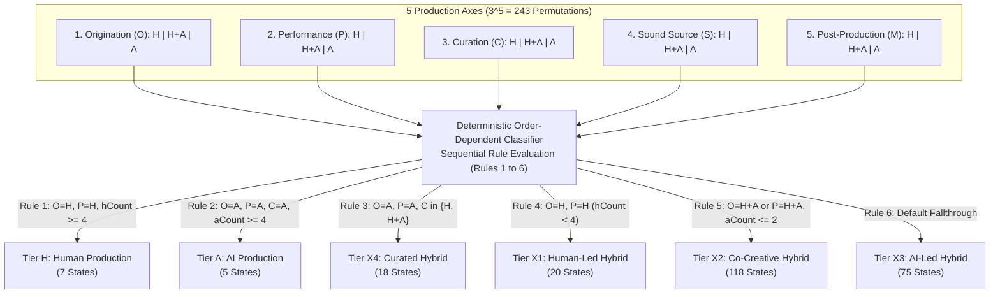

# Technical Whitepaper: The Hybrid Production Standard (HPS-1.0)

**A Multi-Axis Operational Framework for AI Attestation, Process Classification, Cryptographic Provenance, and Linked Data in Music Creation**

- **Standard Identifier**: HPS-1.0 Whitepaper
- **Document Version**: 1.0.0 (Final Specification)
- **Publication Date**: August 2026
- **Author**: Justin Ray / HPS Standards Working Group
- **Publisher Organization**: [TrustNodeLogic](https://trustnodelogic.com) (`@id: https://trustnodelogic.com/#organization`)
- **JSON-LD Context**: `https://trustnodelogic.com/hps/ns/1.0/context.jsonld`
- **Normative Schema**: `https://hps-standard.org/schema/hps-manifest-1.0.json`
- **Target Audience**: Audio Engineers, Software Developers, Music Distributors, Streaming Platforms (DSPs), Rights Management Societies, and Legal Compliance Officers

---

## 1. Executive Summary

### 1.1 The Problem
The rapid emergence of artificial intelligence (AI) foundation models capable of symbolic composition, raw audio synthesis, neural vocal cloning, and automated mixing has transformed contemporary music production. As creators integrate AI tools alongside traditional performance and composition, the boundaries between human agency and algorithmic generation have blurred. 

Existing metadata systems and regulatory initiatives attempt to address this transformation through **binary disclosure flags** (e.g., `Is_AI_Generated: True/False`). Binary flags create severe systemic distortions:
- **Over-Flagging (False Positives)**: Human producers who utilize utility DSP tools (e.g., intelligent noise suppression, adaptive equalization, utility pitch tuning) are misclassified as "AI creators," exposing them to algorithmic penalties or rejection by distribution platforms.
- **Labor Stripping (False Negatives)**: Human producers who utilize a generative AI seed but spend dozens of hours re-arranging, chopping stems, writing original lyrics, tracking live acoustic instruments, and mixing the track have their human labor completely erased under an unqualified "AI" label.
- **Fragility**: Unsigned metadata checkboxes can be stripped or modified during file processing without detection, leaving rights organizations and marketplaces with unverifiable claims.

### 1.2 Why Provenance Matters
Provenance—the verifiable, immutable record of how an audio recording was created—is essential for:
1. **Legal & Regulatory Compliance**: Fulfilling mandatory transparency directives such as **Article 50 of the European Union AI Act (Regulation EU 2024/1689)**.
2. **Rights Management & Licensing**: Enabling collecting societies (BMI, ASCAP, PRS, SACEM) to calculate accurate royalty distributions based on human compositional contribution.
3. **Marketplace Transparency**: Providing sample libraries, distributors, and streaming platforms with verifiable proof of asset origins.
4. **Consumer & Artist Trust**: Protecting human musicians from credit erasure while giving AI-collaborative creators a transparent mechanism to disclose tool usage without stigma.

### 1.3 How HPS Solves the Transparency Gap
The **Hybrid Production Standard (HPS-1.0)** replaces binary disclosure with a granular, multi-dimensional classification system:
- **Process-Based Evaluation**: HPS measures *process*, not tool presence, evaluating human vs. AI contribution across five independent production stages (*Origination*, *Performance*, *Curation*, *Sound Source*, and *Post-Production*).
- **Deterministic 243-State Classification**: An order-dependent evaluation classifier maps all $3^5 = 243$ possible axis state combinations into a clear six-tier production scale (`H`, `X1`, `X2`, `X3`, `X4`, `A`).
- **Cryptographic Provenance & Tamper-Evidence**: Attestations are sealed into canonical JSON/JSON-LD manifests bound to the uncompressed Pulse Code Modulation (PCM) audio essence via SHA-256 digests and RFC 8032 Ed25519 digital signatures.
- **Acoustic Watermarking & Container Embedding**: Manifest payloads travel directly with the audio file via RIFF container chunks (`hps1`), ID3v2.4 frames (`TXXX`), DDEX ERN 4.3 XML blocks (`<hps:HPSClassificationBlock>`), and optional inaudible time-domain spread-spectrum acoustic watermarks.

---

## 2. Background & Motivation

### 2.1 The Rise of AI-Generated Music and Workflow Hybridization
Music technology has continually evolved through technological augmentation—from multitrack magnetic tape to MIDI sequencing and software synthesizers. Modern neural models differ fundamentally because they possess *generative autonomy*. Deep learning architectures can now synthesize full two-channel audio waveforms, generate complex MIDI arrangements, and emulate human singing voices from simple text prompts.

However, professional music creation rarely occurs in binary isolation. Musicians infrequently rely on 100% autonomous prompt generation; instead, modern workflows are deeply hybrid:
- A producer may generate a harmonic progression using a generative assistant, manually chop and re-pitch the MIDI, track a human lead vocal, synthesize backing harmonies via neural models, and mix the project in a traditional Digital Audio Workstation (DAW).
- A songwriter may record live acoustic guitar and lead vocals, but use generative diffusion models to construct background environmental soundscapes or automated mastering engines to finalize dynamic range.

### 2.2 Lack of Provenance Standards in Audio Containers
Standard digital audio container formats (such as WAV RIFF, MP3, FLAC, and AAC) were designed to convey uncompressed or compressed sample payloads, not production provenance. When a DAW project is rendered to a flat audio master, all structural session metadata—plugin inventories, track arrangements, MIDI parameters, and edit histories—is stripped.

Downstream actors in the music supply chain (distributors, aggregators, streaming services, and performance rights organizations) receive flat audio files without any mechanism to verify how the content was produced.

### 2.3 Systemic Risks Across the Supply Chain

```
+-------------------+      +-------------------+      +-------------------+
|  CREATORS         | ---> |  DISTRIBUTORS     | ---> |  MARKETPLACES &   |
| Risk: Credit      |      | Risk: Regulatory  |      |  STREAMING DSPs   |
| erasure & over-   |      | non-compliance &  |      | Risk: Catalog     |
| flagging penalty  |      | audit liability   |      | pollution & fraud |
+-------------------+      +-------------------+      +-------------------+
```

- **For Artists**: Risk of systemic over-flagging by automated detection algorithms, loss of copyright protection, or complete erasure of human editorial effort.
- **For Distributors**: Exposure to legal non-compliance penalties under regional AI transparency regulations, inability to audit incoming catalog submissions, and ingestion pipeline delays.
- **For Marketplaces & Streaming DSPs**: Inability to differentiate authentic human recordings from mass-generated synthetic spam, resulting in catalog pollution and listener churn.

---

## 3. The HPS Framework & 243-State Matrix

HPS-1.0 establishes an objective, deterministic framework for attesting to and classifying human and AI participation.


```
       [H] -------------- [X1] -------------- [X2] -------------- [X3] -------------- [X4] -------------- [A]
Human Production   Human-Led Hybrid    Co-Creative Hybrid    AI-Led Hybrid      Curated Hybrid     AI Production
 (AI Utility Only)  (Human Lead/Perf)  (Direct Co-Creation) (AI Seed/Human Rework) (AI Gen/Human Edit) (100% Synthetic)
```

### 3.1 The Five Operational Axes
HPS-1.0 evaluates a music recording across five discrete, sequential stages of production:

1. **Origination ($O$)**: Composition, songwriting, melody, chord progressions, lyrics, and structural seed generation.
2. **Performance ($P$)**: Vocal tracking, physical instrument performance, MIDI execution, and expressive timing.
3. **Curation ($C$)**: Editorial stem selection, structural chopping, arrangement sequencing, and sound editing.
4. **Sound Source ($S$)**: Timbral provenance (acoustic instruments, analog/subtractive synthesis, vs. neural diffusion sound generators).
5. **Post-Production ($M$)**: Dynamic processing, equalization, spatial placement, mixing, and final mastering.

### 3.2 Permissible Axis States & Utility Processing Exemption
Every axis MUST be evaluated to exactly one of three permissible states:
- **`H` (Human)**: Executed exclusively by human labor or traditional non-generative processing.
- **`H+A` (Human + AI Collaborative)**: Executed via interactive collaboration between human creators and generative AI tools.
- **`A` (AI Autonomous)**: Executed by generative AI systems or neural models without active human performance or compositional modification.

#### Normative Utility DSP Exemption Rule
Standard non-generative utility digital signal processing (e.g., static equalizers, dynamic compressors, surgical notch filters, parametric reverb, and utility pitch correction used strictly for intonation tuning) MUST be classified as **`H`**. A tool MUST NOT be classified as `A` or `H+A` merely because its internal parameters utilize machine learning optimization heuristics, provided it does not generate novel compositional, performance, or timbral material.

### 3.3 The Human→AI Production Scale (6 Tiers)

| Tier Code | Tier Name | Formal Definition | Normative Condition | Verified State Count |
| :--- | :--- | :--- | :--- | :---: |
| **`H`** | **Human Production** | 100% human creation and execution across primary axes. AI usage is strictly restricted to corrective post-production utility tools. | $O=\text{H} \land P=\text{H} \land hCount \ge 4$ | **7 states** |
| **`X1`** | **Human-Led Hybrid** | Primary composition and performance are fully human-executed; generative AI is utilized solely for secondary textures or automated post-production. | $O=\text{H} \land P=\text{H} \land hCount < 4$ | **20 states** |
| **`X2`** | **Co-Creative Hybrid** | Human and AI collaborate directly during origination or performance. Human retains full editorial, structural, and arrangement control. | $(O=\text{H+A} \lor P=\text{H+A}) \land aCount \le 2$ | **118 states** |
| **`X3`** | **AI-Led Hybrid** | Generative AI provides the primary structural or compositional seed; a human producer substantially reworks, re-samples, or edits the material into a final work. | Default fallthrough for unassigned hybrid states | **75 states** |
| **`X4`** | **Curated Hybrid** | Generative AI executes composition, performance, and sound synthesis; human involvement is confined to selection, structural arrangement, stem mixing, and curation. | $O=\text{A} \land P=\text{A} \land C \in \{\text{H}, \text{H+A}\}$ | **18 states** |
| **`A`** | **AI Production** | Fully synthetic generation across composition, performance, curation, and synthesis. Human input is limited to text prompts or unedited selection. | $O=\text{A} \land P=\text{A} \land C=\text{A} \land aCount \ge 4$ | **5 states** |
| **Total** | | **Complete Exhaustive Coverage** | | **243 states** |

### 3.4 The 243-State Classifier Architecture & Flow

The 5 production axes with 3 state options yields exactly $3^5 = 243$ unique operational configurations. The diagram below illustrates how all 243 states pass through the order-dependent evaluation rules without collision or unclaimed states:



#### Mathematical Gating & The Curation Three-Way Gate
The classifier enforces a strict three-way gate on Curation ($C$):
- $C = \text{A}$ is mandatory for **Tier A**.
- $C \in \{\text{H}, \text{H+A}\}$ is mandatory for **Tier X4** when $O=\text{A}$ and $P=\text{A}$.
This ensures that a human producer who curates and arranges fully synthetic stems is credited with Tier X4 rather than collapsed into Tier A.

### 3.5 Classification Examples

#### Example 1: Singer-Songwriter using Neural Pitch Correction
- **Axes**: Origination: `H`, Performance: `H`, Curation: `H`, Sound Source: `H`, Post-Production: `H` (Utility pitch tuner)
- **Classifier**: Matches Rule 1 ($O=\text{H}, P=\text{H}, hCount=5$).
- **Derived Tier**: **`H` (Human Production)**.

#### Example 2: Producer Reworking an AI Generative Seed
- **Axes**: Origination: `A` (AI generative seed), Performance: `A` (Synthetic tracking), Curation: `H` (Chopped stems, re-arranged in DAW), Sound Source: `A` (Neural audio), Post-Production: `H` (Manual DAW mix)
- **Classifier**: Matches Rule 3 ($O=\text{A}, P=\text{A}, C=\text{H}$).
- **Derived Tier**: **`X4` (Curated Hybrid)**.

#### Example 3: Interactive Human-AI Co-Creation
- **Axes**: Origination: `H+A` (AI melody assistant + human edits), Performance: `H+A` (Human guitar + neural synth layer), Curation: `H`, Sound Source: `H`, Post-Production: `H`
- **Classifier**: Matches Rule 5 ($O=\text{H+A}, aCount=0$).
- **Derived Tier**: **`X2` (Co-Creative Hybrid)**.

---

## 4. Provenance Manifest Specification

### 4.1 Manifest Structure & JSON-LD Linked Data Context
An HPS-1.0 Manifest is a UTF-8 JSON / JSON-LD document adhering to `schema/hps-manifest-1.0.json` and `schema/hps-context-1.0.jsonld`.

```json
{
  "$schema": "https://hps-standard.org/schema/hps-manifest-1.0.json",
  "@context": [
    "https://schema.org",
    "https://trustnodelogic.com/hps/ns/1.0/context.jsonld"
  ],
  "@id": "https://trustnodelogic.com/manifests/b94d27b9934d3e08a52e52d7da7dabfac484efe37a5380ee9088f7ace2efcde9",
  "@type": ["HPSManifest", "CreativeWork"],
  "publisher": {
    "@id": "https://trustnodelogic.com/#organization",
    "name": "TrustNodeLogic",
    "url": "https://trustnodelogic.com"
  },
  "hps_version": "1.0",
  "tier": "X2",
  "axes": {
    "origination": "H+A",
    "performance": "H+A",
    "curation": "H",
    "sound_source": "H",
    "post_production": "H"
  },
  "overrides": [
    {
      "axis": "origination",
      "autoValue": "A",
      "overriddenTo": "H+A",
      "evidence": ["User re-harmonized 60% of generative MIDI notes"]
    }
  ],
  "tool_chain": [
    {
      "stage": "origination",
      "tool": "AI Generative Assistant v2",
      "type": "ai_assistant"
    }
  ],
  "creator": {
    "@id": "https://trustnodelogic.com/#justin-ray",
    "name": "Justin Ray",
    "hps_id": "ed25519:7b3a9c...8f12"
  },
  "content_hash": {
    "algorithm": "sha256",
    "scope": "raw_audio_essence",
    "value": "b94d27b9934d3e08a52e52d7da7dabfac484efe37a5380ee9088f7ace2efcde9"
  },
  "attestation_method": "daw_analysis",
  "timestamp": "2026-08-05T12:00:00Z",
  "signature": {
    "algorithm": "ed25519",
    "public_key": "7b3a9c...8f12",
    "value": "9a2f1c...4b8e"
  },
  "signatures": []
}
```

### 4.2 Field Requirements & Data Contracts
- **Mandatory Fields**: `$schema`, `hps_version`, `tier`, `axes`, `tool_chain`, `creator`, `content_hash`, `attestation_method`, `timestamp`, `signature`.
- **Optional Fields**: `@context`, `@id`, `@type`, `publisher`, `overrides[]` (override audit trail), `signatures[]` (multi-party co-signers).
- **Canonicalization Rules**: Prior to Ed25519 signing or SHA-256 verification, manifest keys MUST be recursively sorted in lexicographical ASCII order, with insignificant whitespace stripped (`sortKeysRecursive`).

### 4.3 Versioning Policy
HPS follows Semantic Versioning 2.0.0 (`MAJOR.MINOR.PATCH`).
- `MAJOR`: Breaking schema modifications, tier redefinitions, or classifier rule restructuring.
- `MINOR`: Additive schema fields, new tool classification categories, or non-breaking JSON-LD/XML extensions.
- `PATCH`: Errata, documentation clarifications, and non-substantive text corrections.

### 4.4 Interoperability with DDEX ERN 4.3 XML
HPS manifests map directly into DDEX ERN 4.3 release messages via an extension namespace (`xmlns:hps="https://trustnodelogic.com/hps/ns/1.0"`):

```xml
<hps:HPSClassificationBlock xmlns:hps="https://trustnodelogic.com/hps/ns/1.0">
  <hps:Tier>X2</hps:Tier>
  <hps:AttestationMethod>daw_analysis</hps:AttestationMethod>
  <hps:CreatorHpsId>ed25519:7b3a9c...8f12</hps:CreatorHpsId>
  <hps:ManifestPublicKey>7b3a9c...8f12</hps:ManifestPublicKey>
  <hps:ManifestSignatureValue>9a2f1c...4b8e</hps:ManifestSignatureValue>
  <hps:RawManifestPayload>eyIkc2NoZW1hI...==</hps:RawManifestPayload>
  <hps:Axes>
    <hps:Origination>H+A</hps:Origination>
    <hps:Performance>H+A</hps:Performance>
    <hps:Curation>H</hps:Curation>
    <hps:SoundSource>H</hps:SoundSource>
    <hps:PostProduction>H</hps:PostProduction>
  </hps:Axes>
</hps:HPSClassificationBlock>
```

---

## 5. Attestation & Verification Workflow

This section outlines the conceptual architectural stages of the HPS attestation and verification lifecycle, reflecting standard-setting reference patterns (such as those prototyped in the reference TrustNodeLogic attestation architecture).

```
+-----------------------------------------------------------------------------------+
|                           HPS ATTESTATION & VERIFICATION                          |
+-------------------+--------------------+--------------------+---------------------+
| 1. DAW Session    | 2. Forensic Tool   | 3. Cryptographic   | 4. Verification     |
|    Introspection  |    Detection &     |    Sealing &       |    & Tamper         |
|    Parsing        |    Axis Suggestion |    Watermarking    |    Validation       |
+-------------------+--------------------+--------------------+---------------------+
```

### 5.1 DAW Session Parsing & Introspection
During project export, an attestation engine introspects DAW session file structures (e.g., Ableton `.als` XML structures, Logic Pro `.logicx` project bundles/plists, and FL Studio `.flp` binary event streams).
- **Plugin Introspection**: Scans active session track chains, extracting VST3 GUIDs, AudioUnit ID triplets, VST2 identifiers, and plugin display names.
- **Sample Directory Introspection**: Analyzes audio sample file paths and metadata tags for generative audio signatures or known synthetic stem markers.

### 5.2 AI-Tool Detection Heuristics & 5-Axis Suggestion Logic
An AI-tool detection engine matches session introspection data against a multi-tier database:
1. **Exact Binary ID Matching**: Matches immutable VST3 GUIDs or AU ID triplets to identify renamed plugins.
2. **Name Pattern Matching**: Executes regex pattern evaluation against plugin titles.
3. **Behavioral Node Heuristics**: Analyzes routing patterns (e.g., MIDI output with zero audio input, typical of generative composition assistants), scoring likelihood ($0.0 - 1.0$).

The engine synthesizes these findings into suggested initial values across the 5 axes. Creators retain full agency to review, edit, or override any suggested value. Any manual override triggering a contradiction against auto-detected evidence is recorded in the `overrides[]` array for transparent downstream auditing.

### 5.3 Cryptographic Sealing & Self-Sovereign Identity
- **Self-Sovereign Keypairs**: The creator generates an Ed25519 keypair locally. Private keys are retained in client-side storage and never transmitted over network protocols.
- **Audio Essence Hashing**: The engine extracts the uncompressed PCM sample data of the final master render, computing a SHA-256 digest (`content_hash.value`).
- **Digital Signing**: The canonicalized JSON manifest payload is signed using the creator's Ed25519 private key (RFC 8032), creating a tamper-evident digital seal.

### 5.4 Container Embedding & Reversible Acoustic Watermarking
- **RIFF WAV Embedding**: The manifest payload is written to a custom `hps1` FourCC chunk in the WAV container.
- **MP3 Container Embedding**: The manifest payload is written to an ID3v2.4 `TXXX` frame (`HPS_MANIFEST_1.0`).
- **Time-Domain DSSS Acoustic Watermarking**: To preserve provenance across lossy transcodes or physical playback, a 64-bit signature ID is modulated via time-domain Direct Sequence Spread Spectrum (DSSS) BPSK across PCM audio samples. The payload includes a 16-bit Barker sync marker (`1110001001000000`). Energy is dynamically scaled relative to local window RMS (capped at -20 dB, max $\alpha = 0.04$), ensuring inaudibility while remaining zero-energy during silent passages ($\text{RMS} < 10^{-5}$).

### 5.5 Verification Pipeline & Multi-Party Co-Signing
Downstream verifiers execute a 3-point verification pipeline:
1. **Audio Essence Digest Verification**: Re-computes the SHA-256 digest of the audio PCM essence, validating against `content_hash.value`.
2. **Ed25519 Signature Validation**: Validates the hex signature against the public key (`hps_id`).
3. **Classifier Consistency Check**: Re-evaluates the 5 declared axes against the 243-state classifier rules to ensure the declared `tier` matches the mathematical classification output.

#### Multi-Party Co-Signing (`signatures[]`)
Co-creators, mix engineers, or distributors countersign an existing manifest by appending an entry to `signatures[]`, preserving the primary creator's original signature while establishing a multi-party chain of trust.

---

## 6. Regulatory Alignment: EU AI Act Article 50

### 6.1 Article 50 Transparency Directives
Regulation (EU) 2024/1689 (EU AI Act) establishes comprehensive transparency obligations for artificial intelligence systems operating within the European Union market:

- **Article 50(2)** mandates that providers and deployers of AI systems that generate or manipulate audio content MUST ensure that outputs are marked in a machine-readable format and detectable as artificially generated or manipulated.
- **Phased Implementation Deadlines**: General transparency obligations apply starting **August 2, 2026**. Machine-readable marking requirements for AI systems placed on the market prior to this date become enforceable by **December 2, 2026**.
- **Provider vs. Deployer Scope**: Obligations fall on system providers and commercial deployers, rather than individual human artists using utility software.

### 6.2 How HPS Fulfills Technical Compliance Mandates

```
+-----------------------------------------------------------------------------------+
|                        EU AI ACT ARTICLE 50 MANDATES                              |
+-------------------+--------------------+--------------------+---------------------+
| Article 50(2)     | Machine-Readable   | Tamper-Evidence    | Auditable Override  |
| Marking Directive | Standard JSON/XML  | Ed25519 & SHA-256  | Logging             |
| Requirements      | Payload Formatting | Essence Binding    | (overrides[])       |
+-------------------+--------------------+--------------------+---------------------+
```

1. **Machine-Readable Standard Formatting**: HPS manifests provide standardized JSON, JSON-LD, and DDEX XML structures (`<hps:HPSClassificationBlock>`) readable by ingestion pipelines.
2. **Tamper-Evidence & Authenticity**: Ed25519 digital signatures and SHA-256 essence digests prevent post-export alteration of machine-readable disclosures.
3. **Auditability of Overrides**: The `overrides[]` schema element provides legal compliance officers with transparent records of manual user adjustments against automated tool detection heuristics.

---

## 7. Implementation Guidance

### 7.1 For DAW & VST Plugin Developers
DAWs should incorporate HPS export hooks:
- Inspect session plugin graphs during audio export.
- Auto-populate suggested 5-axis states for user confirmation.
- Format and sign the canonical HPS manifest JSON.
- Write the `hps1` RIFF chunk directly into rendered WAV audio files.

### 7.2 For Music Distributors & Aggregators
Distributors should integrate HPS manifest validation into ingestion pipelines:
- Parse `hps1` RIFF chunks or DDEX XML `<hps:HPSClassificationBlock>` elements.
- Validate Ed25519 signatures and SHA-256 essence digests in milliseconds (Fast Verify).
- Pass validated HPS tier codes directly to DSP delivery feeds.

### 7.3 For Sample Marketplaces & Royalty Libraries
Sample platforms (e.g., Splice, Loopcloud) should stamp all catalog sample packs with HPS metadata:
- Embed `hps1` chunks into individual sample WAVs.
- Provide buyers with cryptographic proof that samples are 100% human-recorded (`Tier H`) or transparently classified hybrid stems (`Tier X1-X4`).

---

## 8. Roadmap & Standardization Path

```
+-------------------+      +-------------------+      +-------------------+
|  HPS-1.0 (CURRENT)| ---> |  HPS-2.0          | ---> |  HPS-3.0          |
| Specification &   |      | In-DAW Real-Time  |      | Decentralized ZK  |
| JSON-LD Schema    |      | Introspection Engine|    | Hash Registries   |
+-------------------+      +-------------------+      +-------------------+
```

### 8.1 Specification Roadmap
- **HPS-1.0 (Current)**: Specification release defining the 5 axes, 243-state classifier, JSON/JSON-LD schemas, Ed25519 signatures, and container embedding formats.
- **HPS-2.0**: Native real-time in-DAW session introspection APIs, automated multi-track stem attestation, and acoustic content fingerprinting for lossy transcode recovery.
- **HPS-3.0**: Decentralized zero-knowledge hash registries (`registry.hps-standard.org`) for public hash verification without centralized database hosting, paired with smart contract royalty routing.

### 8.2 Governance Model & Standards Body Submissions
HPS is governed by the HPS Technical Working Group under [TrustNodeLogic](https://trustnodelogic.com). The specification will be submitted to formal international standards bodies:
- **Audio Engineering Society (AES)**: Standard submission for audio metadata and container chunk specification.
- **Digital Data Exchange (DDEX)**: Formal proposal for inclusion in ERN 4.4 release standards.
- **International Organization for Standardization (ISO)**: Technical Report submission for media provenance frameworks.

---

## 9. Technical Glossary

- **Attestation**: A signed, self-declared statement describing the production process used to create a specific audio recording.
- **Axis**: A discrete stage of the music production workflow evaluated independently (`Origination`, `Performance`, `Curation`, `Sound Source`, `Post-Production`).
- **BPSK**: Binary Phase-Shift Keying. A digital modulation scheme transferring data by altering the phase of a carrier signal.
- **Curation**: The production axis evaluating editorial stem selection, structural chopping, arrangement sequencing, and sound editing.
- **DAW Session Introspection**: Automated parsing of digital audio workstation project structures to identify active plugins, samples, and routing graphs.
- **DSSS**: Direct Sequence Spread Spectrum. A modulation technique where data is multiplied by a pseudo-random noise sequence.
- **Ed25519**: Edwards-curve Digital Signature Algorithm using Curve25519 (RFC 8032).
- **Essence Hash**: The cryptographic SHA-256 digest computed over raw PCM audio sample data.
- **HPS Manifest**: The canonical JSON / JSON-LD structure containing declared axis states, derived tier, creator identity attributes, essence hash, and digital signature.
- **JSON-LD**: JavaScript Object Notation for Linked Data. A W3C standard for expressing machine-readable semantic web graphs.
- **Origination**: The production axis evaluating songwriting, melody, chord progressions, lyrics, and structural seed generation.
- **PCM**: Pulse Code Modulation. Uncompressed digital audio sample representation.
- **Reversible Watermarking**: Acoustic signal modulation embedded into audio PCM data that can be blindly recovered downstream.
- **SHA-256**: Secure Hash Algorithm 256-bit cryptographic digest function (FIPS PUB 180-4).
- **Tier**: The deterministic production classification assigned by the 243-state classifier (`H`, `X1`, `X2`, `X3`, `X4`, `A`).

---

## 10. References

1. **European Parliament & Council**: *Regulation (EU) 2024/1689 laying down harmonised rules on artificial intelligence (Artificial Intelligence Act)*, Official Journal of the European Union, 2024.
2. **IETF RFC 8032**: *Edwards-Curve Digital Signature Algorithm (Ed25519)*, Internet Engineering Task Force, 2017.
3. **NIST FIPS PUB 180-4**: *Secure Hash Standard (SHA-256)*, National Institute of Standards and Technology, 2015.
4. **W3C**: *JSON-LD 1.1: A JSON-based Serialization for Linked Data*, World Wide Web Consortium, 2020.
5. **DDEX**: *Electronic Release Notification Message Suite Standard (ERN 4.3)*, Digital Data Exchange, 2022.
6. **ID3.org**: *ID3 Tag Version 2.4.0 Main Structure & Informal Standard*, 2000.
7. **AES**: *AES31-3-2008: AES standard for network and file transfer of audio - Audio-file transfer and exchange - Part 3: Simple project interchange*, Audio Engineering Society, 2008.
8. **C2PA**: *Coalition for Content Provenance and Authenticity Technical Specification (v1.3)*, 2023.
