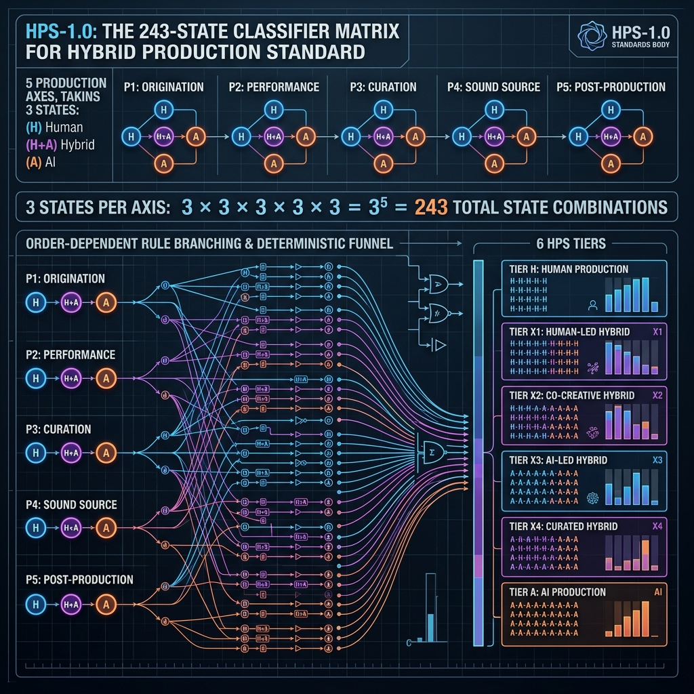
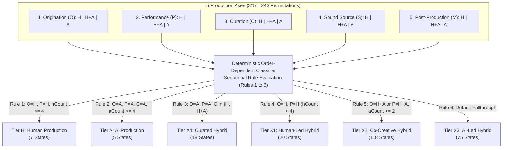

# Technical Whitepaper: The Hybrid Production Standard (HPS-1.0)

**A Multi-Axis Operational Framework for AI Attestation, Process Classification, Cryptographic Provenance, and Linked Data in Music Creation**

- **Standard Identifier**: HPS-1.0 Whitepaper
- **Document Version**: 1.0.0 (Final Specification)
- **Publication Date**: August 2026
- **Author**: Justin Ray / HPS Standards Working Group
- **Publisher Organization**: the HPS Standards Working Group (`@id: https://example-publisher.com/#organization`)
- **JSON-LD Context**: `https://hps-standard.org/ns/1.0/context.jsonld`
- **Normative Schema**: `https://hps-standard.org/schema/hps-manifest-1.0.json`
- **Target Audience**: Audio Engineers, Software Developers, Music Distributors, Streaming Platforms (DSPs), Rights Management Societies, and Legal Compliance Officers

---

## 1. Executive Summary

### 1.1 The Problem
The rapid emergence of artificial intelligence (AI) foundation models capable of symbolic composition, raw audio synthesis, neural vocal cloning, and automated mixing has transformed contemporary music production. As creators integrate AI tools alongside traditional performance and composition, the boundaries between human agency and algorithmic generation have blurred. 

Existing metadata systems and regulatory initiatives attempt to address this transformation through **binary disclosure flags** (e.g., `Is_AI_Generated: True/False`). Binary flags create severe systemic distortions:
- **Over-Flagging (False Positives)**: Human producers who utilize utility DSP tools (e.g., intelligent noise suppression, adaptive equalization, utility pitch tuning) are misclassified as "AI creators," exposing them to algorithmic penalties or rejection by distribution platforms.
- **Labor Stripping (False Negatives)**: Human producers who utilize a generative AI seed but spend dozens of hours re-arranging, chopping stems, writing original lyrics, tracking live acoustic instruments, and mixing the track have their human labor completely erased under an unqualified "AI" label.
- **Fragility**: Unsigned metadata checkboxes can be stripped or modified during file processing without detection, leaving rights organizations and marketplaces with unverifiable claims.

### 1.2 Why Provenance Matters
Provenance—the verifiable, immutable record of how an audio recording was created—is essential for:
1. **Legal & Regulatory Compliance**: Fulfilling mandatory transparency directives such as **Article 50 of the European Union AI Act (Regulation EU 2024/1689)**.
2. **Rights Management & Licensing**: Enabling collecting societies (BMI, ASCAP, PRS, SACEM) to calculate accurate royalty distributions based on human compositional contribution.
3. **Marketplace Transparency**: Providing sample libraries, distributors, and streaming platforms with verifiable proof of asset origins.
4. **Consumer & Artist Trust**: Protecting human musicians from credit erasure while giving AI-collaborative creators a transparent mechanism to disclose tool usage without stigma.

### 1.3 How HPS Solves the Transparency Gap
The **Hybrid Production Standard (HPS-1.0)** replaces binary disclosure with a granular, multi-dimensional classification system:
- **Process-Based Evaluation**: HPS measures *process*, not tool presence, evaluating human vs. AI contribution across five independent production stages (*Origination*, *Performance*, *Curation*, *Sound Source*, and *Post-Production*).
- **Deterministic 243-State Classification**: An order-dependent evaluation classifier maps all $3^5 = 243$ possible axis state combinations into a clear six-tier production scale (`H`, `X1`, `X2`, `X3`, `X4`, `A`).
- **Cryptographic Provenance & Tamper-Evidence**: Attestations are sealed into canonical JSON/JSON-LD manifests bound to the uncompressed Pulse Code Modulation (PCM) audio essence via SHA-256 digests and RFC 8032 Ed25519 digital signatures.
- **Acoustic Watermarking & Container Embedding**: Manifest payloads travel directly with the audio file via RIFF container chunks (`hps1`), ID3v2.4 frames (`TXXX`), DDEX ERN 4.3 XML blocks (`<hps:HPSClassificationBlock>`), and optional inaudible time-domain spread-spectrum acoustic watermarks.

---

## 2. Definitions & Normative Terminology

To facilitate industry adoption across standards bodies (AES, DDEX, ISO), the following formal terms are defined for HPS-1.0:

- **Attestation**: A cryptographically signed, self-declared or auto-detected statement describing the exact human versus AI participation across the five production axes for a specific audio recording.
- **Axis State**: The discrete evaluation value (`H` for Human, `H+A` for Hybrid Collaboration, or `A` for Autonomous AI) assigned to one of the five creation stages (*Origination*, *Performance*, *Curation*, *Sound Source*, *Post-Production*).
- **Generative Autonomy**: The capability of an artificial intelligence model or neural network to generate novel musical structures, MIDI sequences, lyrics, vocal performances, or audio waveforms without direct real-time human performance or manual compositional notation.
- **Hybrid Production**: Any music creation workflow where human creative agency and generative AI systems collaborate interactively across one or more production stages.
- **Linked Data Graph**: A W3C JSON-LD 1.1 metadata structure utilizing `@context`, `@id`, and `@type` parameters to bind attestation manifestations to authoritative web graph entities (e.g., `https://example-publisher.com/#organization`), enabling semantic interoperability.
- **Manifest**: The canonical UTF-8 JSON document containing the declared axis states, derived tier code, creator identity parameters, audio essence digest, and RFC 8032 Ed25519 digital signature. Manifests are canonicalized using RFC 8785 JSON Canonicalization Scheme (JCS) prior to hashing.
- **PCM Essence Digest**: The SHA-256 cryptographic hash computed exclusively over uncompressed Pulse Code Modulation (PCM) sample data, excluding container headers, ID3 tags, or metadata chunks, ensuring the hash remains valid even if metadata is restamped.
- **Verification**: The 3-point automated signature and integrity check validating that (1) an audio file's PCM essence digest matches the manifest hash, (2) the Ed25519 digital signature is cryptographically valid, and (3) the declared production tier matches the rigid deterministic rules of the 243-state classifier.

---

## 3. Background & Motivation

### 3.1 The Rise of AI-Generated Music and Workflow Hybridization
Music technology has continually evolved through technological augmentation—from multitrack magnetic tape to MIDI sequencing and software synthesizers. Modern neural models differ fundamentally because they possess *generative autonomy*. Deep learning architectures can now synthesize full two-channel audio waveforms, generate complex MIDI arrangements, and emulate human singing voices from simple text prompts.

However, professional music creation rarely occurs in binary isolation. Musicians infrequently rely on 100% autonomous prompt generation; instead, modern workflows are deeply hybrid:
- A producer may generate a harmonic progression using a generative assistant, manually chop and re-pitch the MIDI, track a human lead vocal, synthesize backing harmonies via neural models, and mix the project in a traditional Digital Audio Workstation (DAW).
- A songwriter may record live acoustic guitar and lead vocals, but use generative diffusion models to construct background environmental soundscapes or automated mastering engines to finalize dynamic range.

### 3.2 Lack of Provenance Standards in Audio Containers
Standard digital audio container formats (such as WAV RIFF, MP3, FLAC, and AAC) were designed to convey uncompressed or compressed sample payloads, not production provenance. When a DAW project is rendered to a flat audio master, all structural session metadata—plugin inventories, track arrangements, MIDI parameters, and edit histories—is stripped.

Downstream actors in the music supply chain (distributors, aggregators, streaming services, and performance rights organizations) receive flat audio files without any mechanism to verify how the content was produced.

### 3.3 Systemic Risks Across the Supply Chain

```
+-------------------+      +-------------------+      +-------------------+
|  CREATORS         | ---> |  DISTRIBUTORS     | ---> |  MARKETPLACES &   |
| Risk: Credit      |      | Risk: Regulatory  |      |  STREAMING DSPs   |
| erasure & over-   |      | non-compliance &  |      | Risk: Catalog     |
| flagging penalty  |      | audit liability   |      | pollution & fraud |
+-------------------+      +-------------------+      +-------------------+
```

- **For Artists**: Risk of systemic over-flagging by automated detection algorithms, loss of copyright protection, or complete erasure of human editorial effort.
- **For Distributors**: Exposure to legal non-compliance penalties under regional AI transparency regulations, inability to audit incoming catalog submissions, and ingestion pipeline delays.
- **For Marketplaces & Streaming DSPs**: Inability to differentiate authentic human recordings from mass-generated synthetic spam, resulting in catalog pollution and listener churn.

---

## 4. The HPS Framework & 243-State Matrix

HPS-1.0 establishes an objective, deterministic framework for attesting to and classifying human and AI participation.



```
       [H] -------------- [X1] -------------- [X2] -------------- [X3] -------------- [X4] -------------- [A]
Human Production   Human-Led Hybrid    Co-Creative Hybrid    AI-Led Hybrid      Curated Hybrid     AI Production
 (AI Utility Only)  (Human Lead/Perf)  (Direct Co-Creation) (AI Seed/Human Rework) (AI Gen/Human Edit) (100% Synthetic)
```

### 4.1 The Five Operational Axes
HPS-1.0 evaluates a music recording across five discrete, sequential stages of production:

1. **Origination ($O$)**: Composition, songwriting, melody, chord progressions, lyrics, and structural seed generation.
2. **Performance ($P$)**: Vocal tracking, physical instrument performance, MIDI execution, and expressive timing.
3. **Curation ($C$)**: Editorial stem selection, structural chopping, arrangement sequencing, and sound editing.
4. **Sound Source ($S$)**: Timbral provenance (acoustic instruments, analog/subtractive synthesis, vs. neural diffusion sound generators).
5. **Post-Production ($M$)**: Dynamic processing, equalization, spatial placement, mixing, and final mastering.

### 4.2 Permissible Axis States & Utility Processing Exemption
Every axis MUST be evaluated to exactly one of three permissible states:
- **`H` (Human)**: Executed exclusively by human labor or traditional non-generative processing.
- **`H+A` (Human + AI Collaborative)**: Executed via interactive collaboration between human creators and generative AI tools.
- **`A` (AI Autonomous)**: Executed by generative AI systems or neural models without active human performance or compositional modification.

#### Normative Utility DSP Exemption Rule
Standard non-generative utility digital signal processing (e.g., static equalizers, dynamic compressors, surgical notch filters, parametric reverb, and utility pitch correction used strictly for intonation tuning) MUST be classified as **`H`**. A tool MUST NOT be classified as `A` or `H+A` merely because its internal parameters utilize machine learning optimization heuristics, provided it does not generate novel compositional, performance, or timbral material.

### 4.3 The Human→AI Production Scale (6 Tiers)

| Tier Code | Tier Name | Formal Definition | Normative Condition | Classified State Count |
| :--- | :--- | :--- | :--- | :---: |
| **`H`** | **Human Production** | 100% human creation and execution across primary axes. AI usage is strictly restricted to corrective post-production utility tools. | $O=\text{H} \land P=\text{H} \land hCount \ge 4$ | **7 states** |
| **`X1`** | **Human-Led Hybrid** | Primary composition and performance are fully human-executed; generative AI is utilized solely for secondary textures or automated post-production. | $O=\text{H} \land P=\text{H} \land hCount < 4$ | **20 states** |
| **`X2`** | **Co-Creative Hybrid** | Human and AI collaborate directly during origination or performance. Human retains full editorial, structural, and arrangement control. | $(O=\text{H+A} \lor P=\text{H+A}) \land aCount \le 2$ | **118 states** |
| **`X3`** | **AI-Led Hybrid** | Generative AI provides the primary structural or compositional seed; a human producer substantially reworks, re-samples, or edits the material into a final work. | Default fallthrough for unassigned hybrid states | **75 states** |
| **`X4`** | **Curated Hybrid** | Generative AI executes composition, performance, and sound synthesis; human involvement is confined to selection, structural arrangement, stem mixing, and curation. | $O=\text{A} \land P=\text{A} \land C \in \{\text{H}, \text{H+A}\}$ | **18 states** |
| **`A`** | **AI Production** | Fully synthetic generation across composition, performance, curation, and synthesis. Human input is limited to text prompts or unedited selection. | $O=\text{A} \land P=\text{A} \land C=\text{A} \land aCount \ge 4$ | **5 states** |
| **Total** | | **Complete Exhaustive Coverage** | | **243 states** |

### 4.4 The 243-State Classifier Architecture & Flow

The 5 production axes with 3 state options yields exactly $3^5 = 243$ unique operational configurations. The diagram below illustrates how all 243 states pass through the order-dependent evaluation rules without collision or unclaimed states:



---

## 5. Provenance Manifest Specification

### 5.1 Manifest Structure & JSON-LD Linked Data Context
An HPS-1.0 Manifest is a UTF-8 JSON / JSON-LD document adhering to `schema/hps-manifest-1.0.json` and `schema/hps-context-1.0.jsonld`. Prior to computing the manifest signature, the JSON payload (excluding the `signature` field) MUST be canonicalized according to RFC 8785 (JSON Canonicalization Scheme) to prevent cryptographic failure due to whitespace or key ordering differences.

```json
{
  "$schema": "https://hps-standard.org/schema/hps-manifest-1.0.json",
  "@context": [
    "https://schema.org",
    "https://hps-standard.org/ns/1.0/context.jsonld"
  ],
  "@id": "https://example-publisher.com/manifests/b94d27b9934d3e08a52e52d7da7dabfac484efe37a5380ee9088f7ace2efcde9",
  "@type": ["HPSManifest", "CreativeWork"],
  "publisher": {
    "@id": "https://example-publisher.com/#organization",
    "name": "ExamplePublisher",
    "url": "https://example-publisher.com"
  },
  "hps_version": "1.0",
  "tier": "X2",
  "axes": {
    "origination": "H+A",
    "performance": "H+A",
    "curation": "H",
    "sound_source": "H",
    "post_production": "H"
  },
  "overrides": [
    {
      "axis": "origination",
      "autoValue": "A",
      "overriddenTo": "H+A",
      "evidence": ["User re-harmonized 60% of generative MIDI notes"]
    }
  ],
  "tool_chain": [
    {
      "stage": "origination",
      "tool": "AI Generative Assistant v2",
      "type": "ai_assistant"
    }
  ],
  "creator": {
    "@id": "https://example-publisher.com/#creator",
    "name": "Justin Ray",
    "hps_id": "ed25519:7b3a9c...8f12"
  },
  "content_hash": {
    "algorithm": "sha256",
    "scope": "raw_audio_essence",
    "value": "b94d27b9934d3e08a52e52d7da7dabfac484efe37a5380ee9088f7ace2efcde9"
  },
  "attestation_method": "daw_analysis",
  "timestamp": "2026-08-05T12:00:00Z",
  "signature": {
    "algorithm": "ed25519",
    "public_key": "7b3a9c...8f12",
    "value": "9a2f1c...4b8e"
  },
  "signatures": []
}
```

---

## 6. Attestation & Integrity Check Workflow

This section outlines the conceptual architectural stages of the HPS attestation and verification lifecycle, reflecting standard-setting reference patterns (such as those prototyped in the reference attestation architecture).

```
+-----------------------------------------------------------------------------------+
|                           HPS ATTESTATION & INTEGRITY CHECK                          |
+-------------------+--------------------+--------------------+---------------------+
| 1. DAW Session    | 2. Forensic Tool   | 3. Cryptographic   | 4. Integrity Check     |
|    Introspection  |    Detection &     |    Sealing &       |    & Tamper         |
|    Parsing        |    Axis Suggestion |    Watermarking    |    Validation       |
+-------------------+--------------------+--------------------+---------------------+
```

### 6.1 DAW Session Parsing & Introspection
During project export, an attestation engine introspects DAW session file structures (e.g., Ableton `.als` XML structures, Logic Pro `.logicx` project bundles/plists, and FL Studio `.flp` binary event streams).
- **Plugin Introspection**: Scans active session track chains, extracting VST3 GUIDs, AudioUnit ID triplets, VST2 identifiers, and plugin display names.
- **Sample Directory Introspection**: Analyzes audio sample file paths and metadata tags for generative audio signatures or known synthetic stem markers.

### 6.2 AI-Tool Detection Heuristics & 5-Axis Suggestion Logic
An AI-tool detection engine matches session introspection data against a multi-tier database:
1. **Exact Binary ID Matching**: Matches immutable VST3 GUIDs or AU ID triplets to identify renamed plugins.
2. **Name Pattern Matching**: Executes regex pattern evaluation against plugin titles.
3. **Behavioral Node Heuristics**: Analyzes routing patterns (e.g., MIDI output with zero audio input, typical of generative composition assistants), scoring likelihood ($0.0 - 1.0$).

The engine synthesizes these findings into suggested initial values across the 5 axes. Creators retain full agency to review, edit, or override any suggested value. Any manual override triggering a contradiction against auto-detected evidence is recorded in the `overrides[]` array for transparent downstream auditing.

### 6.3 Cryptographic Sealing & Self-Sovereign Identity
- **Self-Sovereign Keypairs**: The creator generates an Ed25519 keypair locally. Private keys are retained in client-side storage and never transmitted over network protocols.
- **Audio Essence Hashing**: The engine extracts the uncompressed PCM sample data of the final master render, computing a SHA-256 digest (`content_hash.value`).
- **Digital Signing**: The RFC 8785 canonicalized JSON manifest payload is signed using the creator's Ed25519 private key (RFC 8032), creating a tamper-evident digital seal.

### 6.4 Container Embedding & Reversible Acoustic Watermarking
- **RIFF WAV Embedding**: The manifest payload is written to a custom `hps1` FourCC chunk in the WAV container.
- **MP3 Container Embedding**: The manifest payload is written to an ID3v2.4 `TXXX` frame (`HPS_MANIFEST_1.0`).
- **Time-Domain DSSS Acoustic Watermarking**: To preserve provenance across lossy transcodes or physical playback, a 64-bit signature ID is modulated via time-domain Direct Sequence Spread Spectrum (DSSS) BPSK across PCM audio samples. The payload includes a 16-bit Barker sync marker (`1110001001000000`). Energy is dynamically scaled relative to local window RMS (capped at -20 dB, max $\alpha = 0.04$), ensuring inaudibility while remaining zero-energy during silent passages ($\text{RMS} < 10^{-5}$).

---

## 7. Practical Use Cases

To demonstrate real-world adoption, this section details how HPS applies comprehensively across all 6 classification tiers plus a standard DAW export workflow:

### 7.1 Tier H: Fully Human Acoustic Track
- **Scenario**: A singer-songwriter records acoustic guitar, lead vocal, upright bass, and percussion in an analog studio, mixing in a DAW with static EQ, optical compression, and utility pitch tuning.
- **Axis Breakdown**: $O=\text{H}, P=\text{H}, C=\text{H}, S=\text{H}, M=\text{H}$ (Utility tuning exempt per §4.2).
- **Derived Tier**: **`Tier H` (Human Production)**.
- **Value**: Establishes 100% human authenticity proof, protecting the artist from false-positive AI flags by automated streaming sweep filters.

### 7.2 Tier X1: Human-Led Hybrid
- **Scenario**: A rock band records all primary instrumentation (drums, bass, guitars, vocals) live in the studio. In post-production, the producer uses a generative AI plugin to synthesize an ambient background pad to sit quietly in the chorus.
- **Axis Breakdown**: $O=\text{H}, P=\text{H}, C=\text{H}, S=\text{H+A}, M=\text{H}$.
- **Derived Tier**: **`Tier X1` (Human-Led Hybrid)**.
- **Value**: Identifies that while AI synthesis was utilized, it was strictly secondary; the core composition and performance are unambiguously human.

### 7.3 Tier X2: Co-Creative Hybrid Pop Production
- **Scenario**: A pop producer generates a 4-bar MIDI chord progression using an AI composition plugin, manually re-harmonizes 60% of the notes, tracks a live human vocalist, uses neural vocal synthesis for secondary backing textures, and mixes manually.
- **Axis Breakdown**: $O=\text{H+A}, P=\text{H+A}, C=\text{H}, S=\text{H}, M=\text{H}$.
- **Derived Tier**: **`Tier X2` (Co-Creative Hybrid)**.
- **Value**: Transparently discloses generative assistance on songwriting/performance while securing human credit for vocal tracking, arrangement, and mixing.

### 7.4 Tier X3: AI-Led Hybrid
- **Scenario**: An EDM producer utilizes a foundational AI model to generate a complete 2-minute instrumental backing track. The producer imports this into their DAW, structures it, and then tracks their own original live vocals over it.
- **Axis Breakdown**: $O=\text{A}, P=\text{H+A}, C=\text{H}, S=\text{H+A}, M=\text{H}$.
- **Derived Tier**: **`Tier X3` (AI-Led Hybrid)**.
- **Value**: Distinguishes tracks where the foundational musical bed is AI-generated, but significant human performance or structural overhaul has been subsequently applied.

### 7.5 Tier X4: Curated Hybrid Sample Stem
- **Scenario**: A sound designer generates a raw drum loop via a neural synthesis model, manually chops the loop into individual drum hits, re-sequences the stems in a DAW sampler, and applies analog outboard saturation.
- **Axis Breakdown**: $O=\text{A}, P=\text{A}, C=\text{H}, S=\text{A}, M=\text{H}$.
- **Derived Tier**: **`Tier X4` (Curated Hybrid)**.
- **Value**: Protects sample pack buyers by attesting that while the raw audio sound source was synthetically generated, human editorial curation created the finalized stem.

### 7.6 Tier A: Autonomous AI-Generated Ambient Piece
- **Scenario**: An artist inputs a text prompt into an autonomous generative foundation model to produce a 3-minute ambient soundscape. The rendered audio is exported directly without editing.
- **Axis Breakdown**: $O=\text{A}, P=\text{A}, C=\text{A}, S=\text{A}, M=\text{A}$.
- **Derived Tier**: **`Tier A` (AI Production)**.
- **Value**: Satisfies mandatory EU AI Act Article 50 disclosure obligations, ensuring machine-readable transparency for commercial deployment.

### 7.7 Workflow Integration: Automated DAW Export
- **Scenario**: A producer clicks "Export Master WAV" in a DAW equipped with an HPS export hook.
- **Workflow**:
  1. DAW introspection automatically detects session plugins (e.g., 1 generative synth, 8 utility EQs).
  2. Auto-suggestion prompts the producer: *"Suggested Classification: Tier X1 (Human-Led Hybrid). Confirm?"*
  3. Producer confirms, Ed25519 signs client-side, and the DAW writes the `hps1` RIFF chunk directly into the exported `.wav` file.

---

## 8. Threat Model & Security Analysis

To achieve formal regulatory alignment and institutional trust, HPS addresses six primary attack vectors:

| Threat Vector | Description | Adversary Goal | HPS Technical Mitigation |
| :--- | :--- | :--- | :--- |
| **T1: Audio Tampering** | Splicing, editing, or modifying the audio payload post-signing. | Alter recording while claiming valid attestation. | **SHA-256 PCM Essence Digest Binding**: Modifying a single audio sample invalidates the digest, failing 3-point signature and integrity check. |
| **T2: Metadata Stripping** | Stripping JSON metadata chunks during format conversion or re-encoding. | Evade AI disclosure requirements. | **DSSS Acoustic Watermarking & Dual-Container Embedding**: Time-domain acoustic watermark survives lossy transcoding and stripping. |
| **T3: False Attestation** | Maliciously declaring an AI track as `Tier H` (Human). | Claim false human authorship for commercial gain. | **Override Audit Logging & Forensic Introspection**: Auto-detection discrepancies are permanently logged in `overrides[]`, creating legal audit trails under Art. 50. |
| **T4: Model-Generated Stems** | Disguising synthetic stems as live studio instruments. | Bypass sample library human-only policies. | **Exact Binary VST3/AU Introspection**: Introspection parses plugin GUIDs directly from session files, catching disguised synthetic plugins. |
| **T5: Provenance Loss** | Loss of creator identity linkage across aggregators. | Strip artist attribution. | **Self-Sovereign Ed25519 Signatures & JSON-LD Graph**: Public key signatures bound to `@id: https://example-publisher.com/#organization`. |
| **T6: Key Compromise / Replay** | Attacker extracts the Ed25519 key or replays an old signed manifest onto new audio. | Forgery of human attestation on synthetic tracks. | **Client-Side Enclaves & Essence Binding**: Keys remain local; replay attacks fail because the SHA-256 PCM digest rigidly binds the signature to the exact audio waveform. |

---

## 9. Comparison to Existing Approaches

| Capability / Feature | Binary AI Checkboxes | Watermark-Only Systems | Proprietary DAW Metadata | Distributor Tagging | **HPS-1.0 Standard** |
| :--- | :---: | :---: | :---: | :---: | :---: |
| **Process-Based Granularity (5 Axes)** | ❌ No | ❌ No | ❌ No | ❌ No | **✅ Yes (5 Axes)** |
| **Deterministic Classifier (243 States)**| ❌ No | ❌ No | ❌ No | ❌ No | **✅ Yes (6 Tiers)** |
| **Tamper-Evident Cryptographic Sealing** | ❌ No | ❌ No | ❌ No | ❌ No | **✅ Yes (Ed25519/SHA-256)**|
| **JSON-LD Linked Data Graph** | ❌ No | ❌ No | ❌ No | ❌ No | **✅ Yes (@organization)**|
| **Utility DSP Exemption Protection** | ❌ No | ❌ No | ❌ No | ❌ No | **✅ Yes (Normative Rule)**|
| **Container & Acoustic Embedding** | ❌ No | Partial (Audio only)| Partial (DAW only) | ❌ Metadata only | **✅ Dual (RIFF/ID3/DSSS)** |
| **Open Standards-Body Spec (AES/DDEX)** | ❌ No | ❌ Proprietary | ❌ Lock-in | ❌ Proprietary | **✅ 100% Open Spec** |

---

## 10. Regulatory Alignment: EU AI Act Article 50

### 10.1 Article 50 Transparency Directives
Regulation (EU) 2024/1689 (EU AI Act) establishes comprehensive transparency obligations for artificial intelligence systems operating within the European Union market:

- **Article 50(2)** mandates that providers and deployers of AI systems that generate or manipulate audio content MUST ensure that outputs are marked in a machine-readable format and detectable as artificially generated or manipulated.
- **Phased Implementation Deadlines**: General transparency obligations apply starting **August 2, 2026**. Machine-readable marking requirements for AI systems placed on the market prior to this date become enforceable by **December 2, 2026**.
- **Provider vs. Deployer Scope**: Obligations fall on system providers and commercial deployers, rather than individual human artists using utility software.

### 10.2 How HPS Fulfills Technical Compliance Mandates
1. **Machine-Readable Standard Formatting**: HPS manifests provide standardized JSON, JSON-LD, and DDEX XML structures (`<hps:HPSClassificationBlock>`) readable by ingestion pipelines.
2. **Tamper-Evidence & Authenticity**: Ed25519 digital signatures and SHA-256 essence digests prevent post-export alteration of machine-readable disclosures.
3. **Auditability of Overrides**: The `overrides[]` schema element provides legal compliance officers with transparent records of manual user adjustments against automated tool detection heuristics.

---

## 11. Implementation Guidance

### 11.1 For DAW & VST Plugin Developers
DAWs should incorporate HPS export hooks:
- Inspect session plugin graphs during audio export.
- Auto-populate suggested 5-axis states for user confirmation.
- Format and sign the canonical HPS manifest JSON.
- Write the `hps1` RIFF chunk directly into rendered WAV audio files.

### 11.2 For Music Distributors & Aggregators
Distributors should integrate HPS manifest validation into ingestion pipelines:
- Parse `hps1` RIFF chunks or DDEX XML `<hps:HPSClassificationBlock>` elements.
- Validate Ed25519 signatures and SHA-256 essence digests in milliseconds (Fast Check).
- Pass validated HPS tier codes directly to DSP delivery feeds.

### 11.3 For Sample Marketplaces & Royalty Libraries
Sample platforms (e.g., Splice, Loopcloud) should stamp all catalog sample packs with HPS metadata:
- Embed `hps1` chunks into individual sample WAVs.
- Provide buyers with cryptographic proof that samples are 100% human-recorded (`Tier H`) or transparently classified hybrid stems (`Tier X1-X4`).

---

## 12. Governance & Versioning

### 12.1 Governance Model
HPS-1.0 is an open specification developed and maintained by the HPS Technical Working Group under the HPS Standards Working Group (`@id: https://example-publisher.com/#organization`). Specification amendments undergo public review, cryptographic evaluation, and backward-compatibility testing prior to adoption.

### 12.2 Versioning & Backward Compatibility Rules
HPS strictly follows Semantic Versioning 2.0.0 (`MAJOR.MINOR.PATCH`):
- `MAJOR` releases (e.g., 2.0.0) indicate structural schema changes or tier classifier rule modifications. Verifiers MUST maintain legacy parsing routines to support historical manifests.
- `MINOR` releases (e.g., 1.1.0) indicate additive schema attributes (e.g., new tool classification types). Minor updates MUST remain fully backward-compatible with 1.0.0 systems.
- `PATCH` releases (e.g., 1.0.1) cover errata and documentation clarifications.

---

## 13. Future Work

The HPS Technical Working Group is actively advancing five key initiatives for future specification iterations:

1. **HPS-2.0 Automated Real-Time In-DAW Introspection**: Developing native C++/Rust VST3/AU SDK extensions for real-time background session tracking and automated manifest generation.
2. **DAW Plugin SDK**: Publishing open-source C++ (`JUCE`), Rust, and TypeScript libraries to enable DAW developers to integrate HPS signing with under 50 lines of code.
3. **Distributor Ingestion API Specifications**: Standardizing REST and gRPC Fast-Verify endpoint contracts (`POST /v1/verify/manifest`) for automated distributor intake pipelines.
4. **Multi-Party Co-Signing Protocols**: Formalizing multi-sig workflows (`signatures[]`) for complex multi-producer, label, and publisher countersigning.
5. **Sample Marketplace Provenance Stamping**: Establishing automated batch-stamping specifications for sample libraries and stem distribution platforms.

---

## 14. References

1. **European Parliament & Council**: *Regulation (EU) 2024/1689 laying down harmonised rules on artificial intelligence (Artificial Intelligence Act)*, Official Journal of the European Union, 2024.
2. **IETF RFC 8032**: *Edwards-Curve Digital Signature Algorithm (Ed25519)*, Internet Engineering Task Force, 2017.
3. **IETF RFC 8785**: *JSON Canonicalization Scheme (JCS)*, Internet Engineering Task Force, 2020.
4. **NIST FIPS PUB 180-4**: *Secure Hash Standard (SHA-256)*, National Institute of Standards and Technology, 2015.
5. **W3C**: *JSON-LD 1.1: A JSON-based Serialization for Linked Data*, World Wide Web Consortium, 2020.
6. **DDEX**: *Electronic Release Notification Message Suite Standard (ERN 4.3)*, Digital Data Exchange, 2022.
7. **ID3.org**: *ID3 Tag Version 2.4.0 Main Structure & Informal Standard*, 2000.
8. **AES**: *AES31-3-2008: AES standard for network and file transfer of audio - Audio-file transfer and exchange - Part 3: Simple project interchange*, Audio Engineering Society, 2008.
9. **C2PA**: *Coalition for Content Provenance and Authenticity Technical Specification (v1.3)*, 2023.
